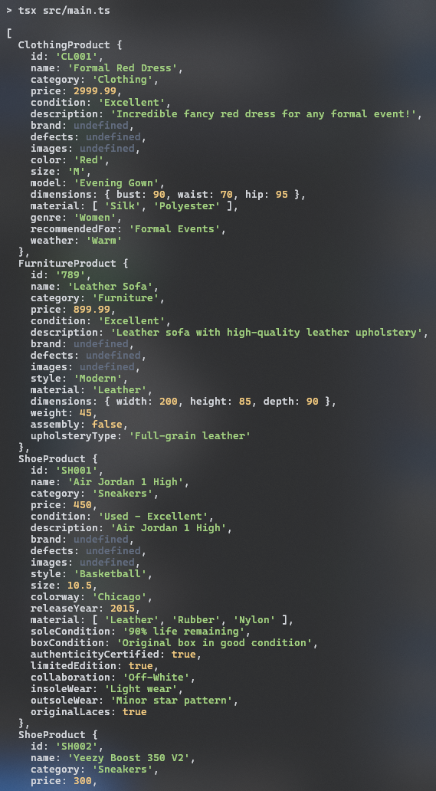

# Builder

## Introdução

O padrão de projeto *Builder* é um dos padrões criacionais definidos pela *Gang of Four* (GoF) no livro clássico *Design Patterns: Elements of Reusable Object-Oriented Software* (Gamma et al., 1994). Esse padrão é amplamente utilizado na engenharia de software para facilitar a construção de objetos complexos de forma controlada e passo a passo, sem expor a lógica detalhada de construção ao cliente. Segundo Freeman e Freeman (2004), o Builder é ideal para situações onde o objeto a ser criado possui várias partes opcionais ou combinações específicas que precisam ser controladas.

## Definição e Propósito

De acordo com Gamma et al. (1994), o *Builder* tem como objetivo separar a construção de um objeto complexo de sua representação, permitindo que o mesmo processo de construção crie diferentes representações do objeto. Essa separação permite criar objetos com configurações diversas sem duplicação de código ou dependências desnecessárias.

Freeman e Freeman (2004) destacam que o *Builder* fornece uma interface fluida para a criação de objetos, reduzindo a complexidade da inicialização e promovendo a reutilização de código. Esse padrão também é útil para garantir que os objetos sejam imutáveis após sua criação, conforme enfatizado por Fowler (2002).

## Estrutura

O padrão é composto pelos seguintes elementos principais (Gamma et al., 1994):

1. *Builder* (Interface Abstrata): Define os métodos que serão implementados pelos *Builders* concretos. Cada método é responsável por construir uma parte específica do objeto.

2. *Concrete* *Builder*: Implementa a interface abstrata *Builder* e constrói partes específicas do produto. Pode armazenar o estado do objeto enquanto ele é construído.

3. *Director*: Controla a sequência de construção. Ele chama os métodos do *Builder* em uma ordem específica para garantir que o objeto seja construído corretamente.

4. *Product*: Representa o objeto complexo que está sendo construído. Geralmente, possui várias partes que são configuradas pelo *Builder*.

## Funcionamento

Freeman e Freeman (2004) explicam que o padrão *Builder* é útil em cenários onde o processo de criação do objeto envolve várias etapas ou combinações de componentes. Por exemplo, ao construir um carro, pode ser necessário configurar motor, assentos e outros componentes de forma independente.

Assim, o *Builder* é particularmente útil em situações em que:

- O processo de criação do objeto envolve várias etapas ou combinações de componentes.

- Existe a necessidade de manter a imutabilidade de objetos criados.

- A lógica de construção precisa ser encapsulada para reduzir acoplamento.

## Vantagens

Gamma et al. (1994) ressaltam que o *Builder* promove a separação de responsabilidades, isolando o código de construção do objeto da lógica do negócio. Além disso, permite criar diferentes representações do mesmo objeto de forma flexível e reutilizável. Para Fowler (2002), o *Builder* também facilita a manutenção do código, pois simplifica a adição de novos tipos de construtores.

## Desvantagens

Embora seja poderoso, o *Builder* pode aumentar a complexidade do projeto, especialmente em situações onde a criação de objetos simples seria suficiente (Gamma et al., 1994). Além disso, o uso de um Director pode introduzir dependências adicionais que nem sempre são necessárias (Freeman & Freeman, 2004).

## Aplicação

A aplicação do padrão de projeto em questão se deu em duas etapas: criação do diagrama e desenvolvimento do código. Cada etapa pode ser conferida em detalhes a seguir.

### Elaboração do Diagrama

O desenvolvimento do diagrama do padrão de projeto *Builder* deve envolver as quatro estruturas apresentadas no tópico [Estrutura](#estrutura). O diagrama apresentado na **Figura 1** abaixo se refere à aplicação do padrão *Builder* em um caso de uso fictício, relacionado ao tema do trabalho do Grupo 02: UnBrechó.

<center>
<figcaption> 

**Figura 1** - Diagrama do padrão de projeto *Builder*.

</figcaption>


<figcaption>

**Fonte:** <a href="https://github.com/MarcoTulioSoares" target="_blank">Marco Túlio</a>, 2024.

</figcaption>
</center>

A utilização de um caso de uso fictício foi incentivada pela proposta acadêmica do presente projeto, de modo que fosse possível estudar os diversos padrões existentes antes de escolher um padrão definitivo a ser utilizado no projeto do UnBrechó.

As estruturas, conforme definido no tópico [Estrutura](#estrutura), são aplicadas no diagrama como classes da seguinte forma:

1. *Builder*: BasePructBuilder, ClothingBuilder, FurnitureBuilder, ShoeBuilder.

2. *Concrete Builder*: Builder.

3. *Director*: ProductDirector.

4. *Product*: BaseProduct, ClothingProduct, FurnitureProduct, ShoeProduct.

### Desenvolvimento do Código

O desenvolvimento do código para aplicação prática do padrão de projeto *Builder* foi feito de acordo com o [Diagrama](#elaboração-do-diagrama) apresentado. Foi utilizada a linguagem de programação Typescript e, para executá-lo, deve-se seguir os passos a seguir:

1. Entrar na pasta code/builder/src

2. Ter instalado o npm (comando: *npm install*)

3. Executar o projeto com o comando *npm run start*

O resultado da execução dos comandos acima deve ser uma saída contendo a representação dos produtos criados, cada um com suas distintas características.

Para fins de visualização sem execução de código ou utilização de linhas de comando, confira as linhas de código abaixo.

- Main

```ts
import { ProductDirector } from "./models/directors/ProductDirector";

const director = new ProductDirector();

const dress = director.createDress();
const sofa = director.createSofa();
const jordan1 = director.createJordan1();
const yeezy = director.createYeezy();

console.log([dress, sofa, jordan1, yeezy]);
```

- BaseProducts

```ts
export abstract class BaseProduct {
  public id: string;
  public name: string;
  public category: string;
  public price: number;
  public condition: string;
  public description: string;
  public brand?: string;
  public defects?: string[];
  public images?: string[];
}
```

- ClothingProducts

```ts
import { BaseProduct } from "./BaseProduct";

export class ClothingProduct extends BaseProduct {
  public color: string;
  public size: string;
  public model: string;
  public dimensions: {
    bust: number;
    waist: number;
    hip: number;
  };
  public material: string[];
  public genre: string;
  public recommendedFor: string;
  public weather: string;
}
```

- FurnitureProducts

```ts
import { BaseProduct } from "./BaseProduct";

export class FurnitureProduct extends BaseProduct {
  public style: string;
  public material: string;
  public dimensions: {
    width: number;
    height: number;
    depth: number;
  };
  public weight: number;
  public assembly: boolean;
  public upholsteryType?: string;
}
```

- ShoeProducts

```ts
import { BaseProduct } from "./BaseProduct";

export class ShoeProduct extends BaseProduct {
  public style: string;
  public size: number;
  public colorway: string;
  public releaseYear: number;
  public material: string[];
  public soleCondition: string;
  public boxCondition?: string;
  public authenticityCertified: boolean;
  public limitedEdition: boolean;
  public collaboration?: string;
  public insoleWear: string;
  public outsoleWear: string;
  public originalLaces: boolean;
}
```

- ProductDirector

```ts
import { ClothingBuilder } from "../builders/ClothingBuilder";
import { FurnitureBuilder } from "../builders/FurnitureBuilder";
import { ShoeBuilder } from "../builders/ShoeBuilder";

export class ProductDirector {
  private clothingBuilder: ClothingBuilder;
  private furnitureBuilder: FurnitureBuilder;
  private shoeBuilder: ShoeBuilder;

  constructor() {
    this.clothingBuilder = new ClothingBuilder();
    this.furnitureBuilder = new FurnitureBuilder();
    this.shoeBuilder = new ShoeBuilder();
  }

  createDress() {
    return this.clothingBuilder
      .setBasicInfo("CL001", "Formal Red Dress", "Clothing")
      .setDescription("Incredible fancy red dress for any formal event!")
      .setPrice(2999.99)
      .setCondition("Excellent")
      .setColor("Red")
      .setSize("M")
      .setModel("Evening Gown")
      .setDimensions(90, 70, 95)
      .setMaterial(["Silk", "Polyester"])
      .setGenre("Women")
      .setRecommendedFor("Formal Events")
      .setWeather("Warm")
      .build();
  }

  createSofa() {
    return this.furnitureBuilder
      .setBasicInfo("789", "Leather Sofa", "Furniture")
      .setDescription("Leather sofa with high-quality leather upholstery")
      .setPrice(899.99)
      .setCondition("Excellent")
      .setStyle("Modern")
      .setMaterial("Leather")
      .setDimensions(200, 85, 90)
      .setWeight(45)
      .setAssembly(false)
      .setUpholsteryType("Full-grain leather")
      .build();
  }

  createJordan1() {
    return this.shoeBuilder
      .setBasicInfo("SH001", "Air Jordan 1 High", "Sneakers")
      .setDescription("Air Jordan 1 High")
      .setPrice(450.0)
      .setCondition("Used - Excellent")
      .setStyle("Basketball")
      .setSize(10.5)
      .setColorway("Chicago")
      .setReleaseYear(2015)
      .setMaterials(["Leather", "Rubber", "Nylon"])
      .setConditionDetails(
        "90% life remaining",
        "Original box in good condition",
        "Light wear",
        "Minor star pattern"
      )
      .setAuthenticity(true)
      .setEditionDetails(true, "Off-White")
      .setOriginalLaces(true)
      .build();
  }

  createYeezy() {
    return this.shoeBuilder
      .setBasicInfo("SH002", "Yeezy Boost 350 V2", "Sneakers")
      .setDescription("Yeezy Boost 350 V2")
      .setPrice(300.0)
      .setCondition("Used - Good")
      .setStyle("Lifestyle")
      .setSize(11)
      .setColorway("Beluga")
      .setReleaseYear(2021)
      .setMaterials(["Primeknit", "Boost", "Rubber"])
      .setConditionDetails(
        "85% life remaining",
        "No original box",
        "Minimal wear",
        "Light tread wear"
      )
      .setAuthenticity(true)
      .setEditionDetails(true)
      .setOriginalLaces(true)
      .build();
  }
}
```

- BaseProductBuilder

```ts
import { BaseProduct } from "../products/BaseProduct";

interface ProductBuilder {
  reset(): void;
  setBasicInfo(id: string, name: string, category: string): this;
  setPrice(price: number): this;
  setCondition(condition: string): this;
  setDescription(description: string): this;
  setBrand(brand: string): this;
  setDefects(defects: string[]): this;
  setImages(images: string[]): this;
}
export abstract class BaseProductBuilder<T extends BaseProduct>
  implements ProductBuilder
{
  protected product: T;

  constructor() {
    this.reset();
  }

  abstract reset(): void;
  abstract build(): T;

  setBasicInfo(id: string, name: string, category: string): this {
    this.product.id = id;
    this.product.name = name;
    this.product.category = category;
    return this;
  }

  setPrice(price: number): this {
    this.product.price = price;
    return this;
  }

  setCondition(condition: string): this {
    this.product.condition = condition;
    return this;
  }

  setDescription(description: string): this {
    this.product.description = description;
    return this;
  }

  setBrand(brand: string): this {
    this.product.brand = brand;
    return this;
  }

  setDefects(defects: string[]): this {
    this.product.defects = defects;
    return this;
  }

  setImages(images: string[]): this {
    this.product.images = images;
    return this;
  }

  protected validateBaseProduct(): void {
    if (
      !this.product.id ||
      !this.product.name ||
      !this.product.category ||
      !this.product.price ||
      !this.product.condition ||
      !this.product.description
    ) {
      console.log(this.product);
      throw new Error("Missing required fields");
    }
  }
}
```

- ClothingBuilder

```ts
import { ClothingProduct } from "../products/ClothingProduct";
import { BaseProductBuilder } from "./BaseProductBuilder";

export class ClothingBuilder extends BaseProductBuilder<ClothingProduct> {
  constructor() {
    super();
    this.reset();
  }

  reset(): void {
    this.product = new ClothingProduct();
  }

  setColor(color: string): this {
    this.product.color = color;
    return this;
  }

  setSize(size: string): this {
    this.product.size = size;
    return this;
  }

  setModel(model: string): this {
    this.product.model = model;
    return this;
  }

  setDimensions(bust: number, waist: number, hip: number): this {
    this.product.dimensions = { bust, waist, hip };
    return this;
  }

  setMaterial(material: string[]): this {
    this.product.material = material;
    return this;
  }

  setGenre(genre: string): this {
    this.product.genre = genre;
    return this;
  }

  setRecommendedFor(recommendedFor: string): this {
    this.product.recommendedFor = recommendedFor;
    return this;
  }

  setWeather(weather: string): this {
    this.product.weather = weather;
    return this;
  }

  build(): ClothingProduct {
    this.validateBaseProduct();
    this.validateClothing();
    const result = this.product;
    this.reset();
    return result;
  }

  private validateClothing(): void {
    if (!this.product.color || !this.product.size || !this.product.model) {
      throw new Error("Missing required clothing fields: color, size, or model");
    }
    if (!this.product.dimensions || !this.product.material) {
      throw new Error("Missing required clothing fields: dimensions or material");
    }
  }
}
```

- FurnitureBuilder

```ts
import { FurnitureProduct } from "../products/FurnitureProduct";
import { BaseProductBuilder } from "./BaseProductBuilder";

export class FurnitureBuilder extends BaseProductBuilder<FurnitureProduct> {
  constructor() {
    super();
    this.reset();
  }

  reset(): void {
    this.product = new FurnitureProduct();
  }

  setStyle(style: string): this {
    this.product.style = style;
    return this;
  }

  setMaterial(material: string): this {
    this.product.material = material;
    return this;
  }

  setDimensions(width: number, height: number, depth: number): this {
    this.product.dimensions = { width, height, depth };
    return this;
  }

  setWeight(weight: number): this {
    this.product.weight = weight;
    return this;
  }

  setAssembly(required: boolean): this {
    this.product.assembly = required;
    return this;
  }

  setUpholsteryType(type: string): this {
    this.product.upholsteryType = type;
    return this;
  }

  build(): FurnitureProduct {
    this.validateBaseProduct();
    this.validateFurniture();
    const result = this.product;
    this.reset();
    return result;
  }

  private validateFurniture(): void {
    if (
      !this.product.style ||
      !this.product.dimensions ||
      !this.product.material
    ) {
      throw new Error("Missing required furniture fields");
    }
  }
}
```

- ShoeBuilder

```ts
import { ShoeProduct } from "../products/ShoeProduct";
import { BaseProductBuilder } from "./BaseProductBuilder";

export class ShoeBuilder extends BaseProductBuilder<ShoeProduct> {
  constructor() {
    super();
    this.reset();
  }

  reset(): void {
    this.product = new ShoeProduct();
  }

  setStyle(style: string): this {
    this.product.style = style;
    return this;
  }

  setSize(size: number): this {
    this.product.size = size;
    return this;
  }

  setColorway(colorway: string): this {
    this.product.colorway = colorway;
    return this;
  }

  setReleaseYear(year: number): this {
    this.product.releaseYear = year;
    return this;
  }

  setMaterials(materials: string[]): this {
    this.product.material = materials;
    return this;
  }

  setConditionDetails(
    soleCondition: string,
    boxCondition: string,
    insoleWear: string,
    outsoleWear: string
  ): this {
    this.product.soleCondition = soleCondition;
    this.product.boxCondition = boxCondition;
    this.product.insoleWear = insoleWear;
    this.product.outsoleWear = outsoleWear;
    return this;
  }

  setAuthenticity(certified: boolean): this {
    this.product.authenticityCertified = certified;
    return this;
  }

  setEditionDetails(limitedEdition: boolean, collaboration?: string): this {
    this.product.limitedEdition = limitedEdition;
    this.product.collaboration = collaboration;
    return this;
  }

  setOriginalLaces(hasOriginalLaces: boolean): this {
    this.product.originalLaces = hasOriginalLaces;
    return this;
  }

  build(): ShoeProduct {
    this.validateBaseProduct();
    this.validateShoe();
    const result = this.product;
    this.reset();
    return result;
  }

  private validateShoe(): void {
    if (!this.product.size || !this.product.style || !this.product.colorway) {
      throw new Error("Missing required shoe fields");
    }
  }
}
```

<center>
<figcaption> 

**Figura 2** - Resultado da execução do código.

</figcaption>



<figcaption>

**Fonte:** <a href="https://github.com/marrcelo" target="_blank">Marcelo Magalhães</a>, 2024.

</figcaption>
</center>

## Referências

> Gamma, E., Helm, R., Johnson, R., & Vlissides, J. (1994). Design Patterns: Elements of Reusable Object-Oriented Software. Addison-Wesley.

> Freeman, E., & Freeman, E. (2004). Head First Design Patterns. O'Reilly Media.

> Fowler, M. (2002). Patterns of Enterprise Application Architecture. Addison-Wesley.

## Histórico de Versão

| Versão | Data       | Descrição            | Autor(es)                                        | Revisor(es) | Resultado da Revisão |
| ------ | ---------- | -------------------- | ------------------------------------------------ | ----------- | -------------------- |
| `1.0`  | 27/12/2024 | Criação do documento | [Ana Hoffmann](https://github.com/AnHoff), [Marco Túlio](https://github.com/MarcoTulioSoares) e [Marcelo Magalhães](https://github.com/marrcelo) | [Ana Hoffmann](https://github.com/AnHoff) | ---                  |
| `1.1`  | 02/01/2025 | Adiciona execução do código | [Ana Hoffmann](https://github.com/AnHoff), [Marco Túlio](https://github.com/MarcoTulioSoares) e [Marcelo Magalhães](https://github.com/marrcelo) | [Ana Hoffmann](https://github.com/AnHoff) | Formatação do código e aprovação de PR. |