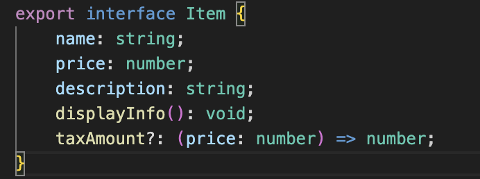

# Factory Method

## Introdução

O padrão de projeto *Factory Method* é um dos padrões criacionais descritos no livro clássico Design Patterns: Elements of Reusable Object-Oriented Software (Gamma et al., 1994). O Factory Method tem como objetivo delegar a responsabilidade de criação de objetos para subclasses, permitindo que a classe principal (ou "fábrica") permaneça flexível e aberta para extensões. Em vez de instanciar objetos diretamente, ele define um método abstrato para criar objetos, deixando que as subclasses determinem qual classe concreta será instanciada.

## Definição e Propósito

O Factory Method é um padrão de projeto criacional que fornece uma interface para criar objetos em uma classe pai, mas permite que as subclasses alterem o tipo de objetos que serão criados.
Em vez de instanciar diretamente as classes concretas, o Factory Method delega a responsabilidade de criação para subclasses específicas, garantindo maior flexibilidade e adesão ao princípio aberto/fechado (Open/Closed Principle).

O principal objetivo do Factory Method é desacoplar a lógica de criação de objetos da lógica de uso desses objetos. Ele resolve o problema de depender diretamente de classes concretas no código cliente, permitindo que novas classes sejam adicionadas com facilidade, sem modificar o código existente.

## Estrutura

O padrão *Factory Method* é composto pelos seguintes elementos principais (Gamma et al., 1994):

- *Creator* (Classe Abstrata): Fornece uma estrutura comum para as subclasses implementarem o Factory Method.

- *ConcreteCreator* (Classe concreta): Implementar o Factory Method definido em *Creator*. Instanciar e retornar objetos concretos específicos.

- *Product* (Interface ou Classe Abstrata): Define o contrato que todos os produtos concretos devem seguir.Desacopla a criação do uso, permitindo que o código cliente interaja com produtos por meio dessa interface, sem conhecer suas implementações concretas.

- *ConcreteProduct* (Classes concretas): Implementar a interface ou classe abstrata *Product*.Fornecer a funcionalidade específica do produto concreto.

## Funcionamento

O Factory Method é utilizado principalmente quando a criação de objetos deve ser desacoplada do código cliente, permitindo que as subclasses decidam qual classe concreta será instanciada.

## Vantagens

Gamma et al. (1994) destacam os seguintes benefícios do padrão *Factory Method*:

- Desacoplamento: O código cliente não precisa conhecer as classes concretas dos produtos.

- Facilidade de extensão: Novos tipos de produtos podem ser adicionados facilmente, sem modificar o código existente.

- Princípio Aberto/Fechado: O padrão permite que o sistema seja aberto para extensão (novos produtos) e fechado para modificação.

## Desvantagens

Apesar de suas vantagens, o padrão *Factory Method* apresenta limitações:

- Complexidade adicional: A introdução do padrão aumenta o número de classes, o que pode deixar o sistema mais complexo.

- Se a criação dos objetos não for flexível o suficiente para justificar o uso de subclasses do Creator, o padrão pode ser visto como redundante, sem ganho significativo sobre a simples criação direta de objetos.

## Aplicação

A aplicação do padrão de projeto em questão se deu em duas etapas: criação do diagrama e desenvolvimento do código. Cada etapa pode ser conferida em detalhes a seguir.

### Elaboração do Diagrama

O desenvolvimento do diagrama do padrão de projeto *Factory Method* deve envolver as estruturas apresentadas no tópico [Estrutura](#estrutura). O diagrama apresentado na **Figura 1** abaixo se refere à aplicação do padrão *Factory Method* em um caso de uso fictício, relacionado ao tema do trabalho do Grupo 02: UnBrechó.

<figcaption> 

**Figura 1** - Diagrama do padrão de projeto *Factory Method*.

</figcaption>

<figcaption>

**Fonte:** <a href="https://github.com/guinuto" target="_blank">Guilherme Evangelista</a>, 2024.

</figcaption>

A utilização de um caso de uso fictício foi incentivada pela proposta acadêmica do presente projeto, de modo que fosse possível estudar os diversos padrões existentes antes de escolher um padrão definitivo a ser utilizado no projeto do UnBrechó.

As estruturas, conforme definido no tópico [Estrutura](#estrutura), são aplicadas no diagrama da seguinte forma:

### Desenvolvimento do Código

O desenvolvimento do código para aplicação prática do padrão de projeto *Factory Method* foi feito de acordo com o [Diagrama](#elaboração-do-diagrama) apresentado. Foi utilizada a linguagem de programação Typescript e, para executá-lo, deve-se seguir os passos a seguir:

1. Entrar na pasta code/factory_method/src

2. Ter instalado o npm (comando: *npm install*)

3. Executar o projeto com o comando *npm start*

O resultado da execução dos comandos acima deve ser uma saída contendo a representação dos produtos criados, cada um com suas distintas características.

Para fins de visualização sem execução de código ou utilização de linhas de comando, confira as Figuras de 2 a 5 abaixo.

<figcaption> 

**Figura 2** - Código *Index*.

</figcaption>

<figcaption>

**Fonte:** <a href="https://github.com/valdersonjr" target="_blank">Valderson Jr</a>, 2024.

</figcaption>

<figcaption> 

**Figura 3** - Factory.

</figcaption>

<figcaption>

**Fonte:** <a href="https://github.com/valdersonjr" target="_blank">Valderson Jr</a>, 2024.

</figcaption>

<figcaption> 

**Figura 4** - Clothing Factory.

</figcaption>

<figcaption>

**Fonte:** <a href="https://github.com/valdersonjr" target="_blank">Valderson Jr</a>, 2024.

</figcaption>

<figcaption> 

**Figura 5** - Product Item.

</figcaption>

<figcaption>

**Fonte:** <a href="https://github.com/valdersonjr" target="_blank">Valderson Jr</a>, 2024.

</figcaption>

<figcaption> 

**Figura 6** - Concrete product Clothing.

</figcaption>

<figcaption>

**Fonte:** <a href="https://github.com/valdersonjr" target="_blank">Valderson Jr</a>, 2024.

</figcaption>

<figcaption> 

**Figura 7** - Execução Factory Method.

</figcaption>

<figcaption>

**Fonte:** <a href="https://github.com/valdersonjr" target="_blank">Valderson Jr</a>, 2024.

</figcaption>

## Referências

Gamma, E., Helm, R., Johnson, R., & Vlissides, J. (1994). Design Patterns: Elements of Reusable Object-Oriented Software. Addison-Wesley.

## Histórico de Versão

| Versão | Data       | Descrição            | Autor(es)                                        | Revisor(es) | Resultado da Revisão |
| ------ | ---------- | -------------------- | ------------------------------------------------ | ----------- | -------------------- |
| `1.0`  | 04/01/2024 | Criação do documento | [Guilherme Evangelista](https://github.com/guinuto), [Valderson Jr](https://github.com/valdersonjr)| ---         | ---                  |