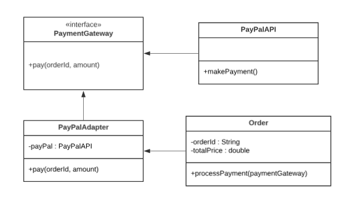
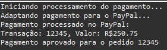

# Adapter

## Introdução

O padrão de projeto Adapter (ou Adaptador) é uma solução de design que visa conectar classes ou interfaces incompatíveis sem alterar seus códigos internos. Ele atua como uma ponte, traduzindo uma interface para outra que o sistema possa compreender. Este padrão é amplamente utilizado em cenários onde a integração de componentes externos ou legados é necessária.

## Definição e Propósito

O _Adapter_ é um padrão de projeto estrutural que converte a interface de uma classe em outra que os clientes esperam. Seu objetivo principal é possibilitar que classes com interfaces incompatíveis possam trabalhar juntas, sem necessidade de modificar seu código original.

**Propósito:** Facilitar a reutilização de código e a integração entre sistemas legados ou componentes de terceiros, permitindo que partes do código sejam utilizadas sem reimplementação.

---

## Estrutura

A estrutura do padrão Adapter consiste em:

1. _Target_ (Alvo): Define a interface que o cliente espera usar.
2. _Client_ (Cliente): O sistema que utiliza o Target.
3. _Adaptee_ (Adaptado): A classe ou componente que possui a interface incompatível.
4. _Adapter_ (Adaptador): Converte a interface do Adaptee para a interface esperada pelo Target.

---

## Funcionamento

1. O cliente chama métodos na interface do Target.
2. O Adapter implementa a interface do Target e traduz as chamadas para a interface do Adaptee.
3. O Adaptee realiza o trabalho solicitado e retorna os resultados para o Adapter.
4. O Adapter repassa o resultado para o cliente no formato esperado.

---

## Vantagens

1. **Reutilização de Código Existente:** Permite a integração de sistemas ou bibliotecas legados sem necessidade de reescrevê-los.
2. **Flexibilidade:** Facilita a troca ou adição de novos componentes sem alterar a estrutura existente.
3. **Isolamento:** Encapsula a complexidade e as diferenças entre interfaces, reduzindo o impacto no restante do código.

---

## Desvantagens

1. **Complexidade Adicional:** A introdução do Adapter pode aumentar a complexidade do sistema, especialmente em projetos pequenos.
2. **Sobrecarga:** Pode introduzir um pequeno overhead de desempenho devido à tradução entre interfaces.

---

## Aplicação

O padrão Adapter é útil em diversas situações, como:

- Integração de APIs externas.
- Conexão entre sistemas legados e novos componentes.
- Reutilização de classes que possuem interfaces incompatíveis com os requisitos atuais do sistema.

<center>
<figcaption>

**Figura 1** - Diagrama do padrão de projeto _Adapter_.

</figcaption>



<figcaption>

**Fonte:** <a href="https://github.com/M4RINH0" target="_blank">Douglas Marinho</a>, 2024.

</figcaption>
</center>

O diagrama acima ilustra a aplicação do padrão Adapter em um sistema de processamento de pagamentos. O objetivo do Adapter é permitir que a classe Order (cliente) utilize uma interface padrão PaymentGateway para realizar pagamentos, sem precisar entender a implementação detalhada da API de pagamento específica, como o PayPalAPI.

### Desenvolvimento do Código

A seguir, um exemplo prático do Adapter implementado em Java para integração com uma API de pagamento (PayPal), elaborado por [Douglas Marinho](https://github.com/M4RINH0), [Eric Camargo](https://github.com/Ericcs10) e [Henrique Torres](https://github.com/henriqtorresl):

- Main

```java
package adapter;


public class Main {
 public static void main(String[] args) {
     // Criando o pedido
     Order order = new Order("12345", 250.75);

     // Configurando o Adapter para usar o PayPal
     PaymentGateway paymentGateway = new PayPalAdapter(new PayPalAPI());

     // Processando o pagamento
     order.processPayment(paymentGateway);
 }
}
```

- Order

```java
package adapter;

public class Order {
 private String orderId;
 private double totalPrice;

 public Order(String orderId, double totalPrice) {
     this.orderId = orderId;
     this.totalPrice = totalPrice;
 }

 public String getOrderId() {
     return orderId;
 }

 public double getTotalPrice() {
     return totalPrice;
 }

 public void processPayment(PaymentGateway paymentGateway) {
     System.out.println("Iniciando processamento do pagamento...");
     boolean success = paymentGateway.pay(orderId, totalPrice);
     if (success) {
         System.out.println("Pagamento aprovado para o pedido " + orderId);
     } else {
         System.out.println("Falha no pagamento do pedido " + orderId);
     }
 }
}
```

- PaymentGateway

```java
package adapter;

public interface PaymentGateway {
    boolean pay(String orderId, double amount);
}
```

- PayPalAdapter

```java
package adapter;

public class PayPalAdapter implements PaymentGateway {
    private PayPalAPI payPal;

    public PayPalAdapter(PayPalAPI payPal) {
        this.payPal = payPal;
    }

    @Override
    public boolean pay(String orderId, double amount) {
        System.out.println("Adaptando pagamento para o PayPal...");
        return payPal.makePayment(orderId, amount);
    }
}
```

- PayPalAPI

```java
package adapter;

public class PayPalAPI {
    public boolean makePayment(String transactionId, double value) {
        System.out.println("Pagamento processado no PayPal:");
        System.out.println("Transação: " + transactionId + ", Valor: R$" + value);
        return true;
    }
}
```

<center>
<figcaption>

**Figura 2** - Resultado da execução do código.

</figcaption>



<figcaption>

**Fonte:** <a href="https://github.com/M4RINH0" target="_blank">Douglas Marinho</a>, 2024.

</figcaption>
</center>

---

### Passo a Passo de Execução

1. **Criação do Pedido:**

   - No método `main`, um objeto da classe `Order` é criado, representando um pedido com ID "12345" e um valor de R$ 250,75.

2. **Configuração do Adapter:**

   - Um objeto `PayPalAPI` (Adaptee) é instanciado.
   - O `PayPalAdapter` (Adapter) é configurado, recebendo a instância de `PayPalAPI` para realizar a adaptação entre as interfaces.

3. **Chamada ao Adapter:**

   - O método `processPayment` da classe `Order` chama o método `pay` da interface `PaymentGateway`.
   - A chamada é interceptada pelo `PayPalAdapter`, que traduz o método `pay` para `makePayment`, a interface nativa do `PayPalAPI`.

4. **Execução pelo Adaptee:**

   - O método `makePayment` do `PayPalAPI` é executado, processando o pagamento e exibindo as mensagens de sucesso no console.

5. **Resultado para o Cliente:**
   - O `PayPalAdapter` retorna o resultado da operação para o método `processPayment`.
   - A classe `Order` exibe a mensagem de confirmação ou falha de pagamento para o cliente no console.

---

## Referências

> Gamma, E., Helm, R., Johnson, R., & Vlissides, J. (1994). **Design Patterns: Elements of Reusable Object-Oriented Software.** Addison-Wesley.

> [Refactoring Guru - Adapter](https://refactoring.guru/design-patterns/adapter)

> Freeman, E., Freeman, E., Bates, B., & Sierra, K. (2004). **Head First Design Patterns.** O'Reilly Media.

## Histórico de Versão

| Versão | Data       | Descrição                                | Autor(es)                                                                                                                                        | Revisor(es)                               | Resultado da Revisão                                                   |
| ------ | ---------- | ---------------------------------------- | ------------------------------------------------------------------------------------------------------------------------------------------------ | ----------------------------------------- | ---------------------------------------------------------------------- |
| `1.0`  | 04/01/2024 | Criação do documento e adição de codigos | [Douglas Marinho](https://github.com/M4RINH0), [Eric Camargo](https://github.com/Ericcs10) e [Henrique Torres](https://github.com/henriqtorresl) | [Ana Hoffmann](https://github.com/AnHoff) | Padronização do documento conforme padrão do projeto e abertura de PR. |
