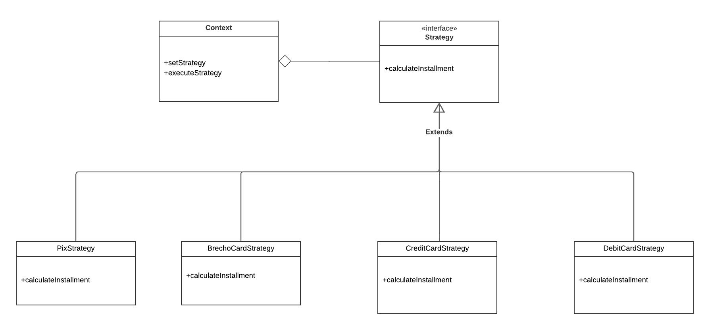

# Builder

## Introdução

O padrão de projeto *Strategy* é um dos padrões comportamentais descritos no livro clássico Design Patterns: Elements of Reusable Object-Oriented Software (Gamma et al., 1994). Este padrão é utilizado para definir uma família de algoritmos, encapsulá-los em classes separadas e torná-los intercambiáveis. Ele promove a separação de responsabilidades, permitindo que diferentes algoritmos sejam selecionados em tempo de execução sem alterar o código do cliente.

## Definição e Propósito

De acordo com Gamma et al. (1994), o padrão *Strategy* permite que diferentes algoritmos ou comportamentos sejam definidos como classes separadas e que o objeto que os utiliza seja capaz de selecionar o algoritmo desejado de forma dinâmica. Essa abordagem promove a substituição de comportamentos em tempo de execução sem modificar a estrutura geral do sistema.

Freeman e Freeman (2004) destacam que o *Strategy* é útil em situações onde há necessidade de alternar entre diferentes comportamentos ou quando se deseja evitar estruturas condicionais complexas, como grandes blocos de código if-else.

## Estrutura

O padrão *Strategy* é composto pelos seguintes elementos principais (Gamma et al., 1994):

- *Strategy* (Interface ou Classe Abstrata): Define a interface comum para todos os algoritmos.

- *Concrete Strategies* (Implementações Concretas): Implementam a interface definida por *Strategy*, fornecendo diferentes variações do algoritmo.

- *Context*: Contém uma referência para um objeto *Strategy* e delega a ele a execução do algoritmo.

## Funcionamento

Freeman e Freeman (2004) explicam que o padrão *Strategy* é útil para evitar duplicação de código e tornar o sistema mais extensível.

## Vantagens

Gamma et al. (1994) destacam os seguintes benefícios do padrão *Strategy*:

- Redução de complexidade: Elimina grandes estruturas condicionais no código.

- Extensibilidade: Novos algoritmos podem ser adicionados sem modificar o código existente.

- Reutilização: Cada algoritmo é isolado em sua própria classe, promovendo reutilização em diferentes contextos.

Freeman e Freeman (2004) enfatizam que o *Strategy* é especialmente útil em sistemas que devem lidar com múltiplas variações de comportamento, garantindo flexibilidade e mantendo o código organizado.

## Desvantagens

Embora seja uma solução interessante, o padrão *Strategy* também apresenta algumas desvantagens:

- Complexidade adicional: Introduz mais classes no sistema, o que pode ser excessivo para problemas simples (Freeman & Freeman, 2004).

- Dependência do Context: O cliente precisa estar ciente da existência de múltiplas estratégias e de como configurá-las.

## Aplicação

A aplicação do padrão de projeto em questão se deu em duas etapas: criação do diagrama e desenvolvimento do código. Cada etapa pode ser conferida em detalhes a seguir.

### Elaboração do Diagrama

O desenvolvimento do diagrama do padrão de projeto *Strategy* deve envolver as quatro estruturas apresentadas no tópico [Estrutura](#estrutura). O diagrama apresentado na **Figura 1** abaixo se refere à aplicação do padrão *Strategy* em um caso de uso fictício, relacionado ao tema do trabalho do Grupo 02: UnBrechó.

<figcaption> 

**Figura 1** - Diagrama do padrão de projeto *Strategy*.

</figcaption>

<figcaption>

**Fonte:** <a href="https://github.com/MarcoTulioSoares" target="_blank">Marco Túlio</a>, 2024.

</figcaption>

A utilização de um caso de uso fictício foi incentivada pela proposta acadêmica do presente projeto, de modo que fosse possível estudar os diversos padrões existentes antes de escolher um padrão definitivo a ser utilizado no projeto do UnBrechó.

As estruturas, conforme definido no tópico [Estrutura](#estrutura), são aplicadas no diagrama da seguinte forma:

### Desenvolvimento do Código

O desenvolvimento do código para aplicação prática do padrão de projeto *Strategy* foi feito de acordo com o [Diagrama](#elaboração-do-diagrama) apresentado. Foi utilizada a linguagem de programação Typescript e, para executá-lo, deve-se seguir os passos a seguir:

1. Entrar na pasta code/builder/src

2. Ter instalado o npm (comando: *npm install*)

3. Executar o projeto com o comando *npm run start*

O resultado da execução dos comandos acima deve ser uma saída contendo a representação dos produtos criados, cada um com suas distintas características.

Para fins de visualização sem execução de código ou utilização de linhas de comando, confira as Figuras de 2 a 5 abaixo.

<figcaption> 

**Figura 2** - Código *Main* do *Strategy*.

</figcaption>

<figcaption>

**Fonte:** <a href="https://github.com/marrcelo" target="_blank">Marcelo Magalhães</a>, 2024.

</figcaption>

<figcaption> 

**Figura 3** - Aplicação do *Strategy*.

</figcaption>

<figcaption>

**Fonte:** <a href="https://github.com/marrcelo" target="_blank">Marcelo Magalhães</a>, 2024.

</figcaption>

<figcaption> 

**Figura 4** - *Context* do *Strategy*.

</figcaption>

<figcaption>

**Fonte:** <a href="https://github.com/marrcelo" target="_blank">Marcelo Magalhães</a>, 2024.

</figcaption>

<figcaption> 

**Figura 5** - Códigos do *Strategy* e dos *Concrete Strategies*.

</figcaption>

<figcaption>

**Fonte:** <a href="https://github.com/marrcelo" target="_blank">Marcelo Magalhães</a>, 2024.

</figcaption>

## Referências

Gamma, E., Helm, R., Johnson, R., & Vlissides, J. (1994). Design Patterns: Elements of Reusable Object-Oriented Software. Addison-Wesley.

Freeman, E., & Freeman, E. (2004). Head First Design Patterns. O'Reilly Media.

Fowler, M. (2002). Patterns of Enterprise Application Architecture. Addison-Wesley.

## Histórico de Versão

| Versão | Data       | Descrição            | Autor(es)                                        | Revisor(es) | Resultado da Revisão |
| ------ | ---------- | -------------------- | ------------------------------------------------ | ----------- | -------------------- |
| `1.0`  | 01/01/2024 | Criação do documento | [Ana Hoffmann](https://github.com/AnHoff), [Marco Túlio](https://github.com/MarcoTulioSoares) e [Marcelo Magalhães](https://github.com/marrcelo) | ---         | ---                  |
| `1.1`  | 02/01/2024 | Adição de imagens do código | [Ana Hoffmann](https://github.com/AnHoff), [Marco Túlio](https://github.com/MarcoTulioSoares) e [Marcelo Magalhães](https://github.com/marrcelo) | ---         | ---                  |