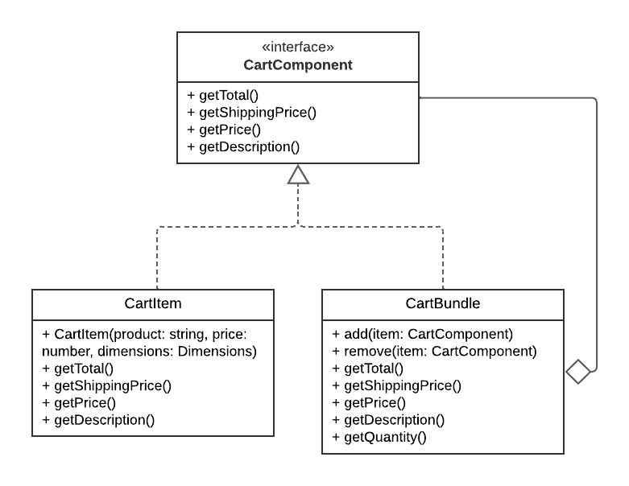
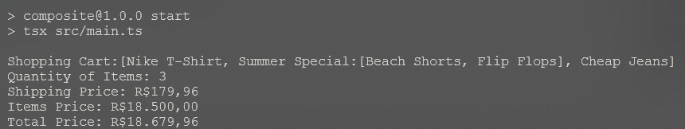

# Composite

## Introdução

O padrão de projeto *Composite* é um dos padrões estruturais definidos pela *Gang of Four* (GoF) no livro clássico *Design Patterns: Elements of Reusable Object-Oriented Software* (Gamma et al., 1994). Ele é usado para compor objetos como estruturas de árvore e então trabalhe com elas como se fossem objetos individuais, tratando estruturas e objetos da mesma forma.

## Definição e Propósito

De acordo com Gamma et al. (1994), o *Composite* tem como objetivo possibilitar a composição objetos como estruturas de árvore e trabalhe com elas como se fossem objetos individuais, permitindo que tanto objetos quanto composições de objetos sejam tratados de forma uniforme, sendo utilizados através de uma interface comum para ambos.

O que geralmente acontece é que os métodos na estrutura delegam tarefas para os elementos que a compõem. Os métodos nesses elementos, por sua vez, realizam algum tipo de trabalho, e retornam o resultado para a estrutura. Dessa maneira, usar o método na estrutura ou no objeto diretamente retorna o mesmo resultado, permitindo o tratamento idêntico no código.

Seu uso só faz sentido quando o modelo central da aplicação pode ser representado como uma árvore. Nesse caso, usar o *Composite* ajuda a simplificar a escrita do código do programa, facilitando a utilização da estrutura.

## Estrutura

A estrutura do Composite tem os seguintes elementos (Gamma et al., 1994):

1. *Component*: interface com métodos comuns para objetos e estruturas, que devem ser implementados por ambos.

2. *Leaf*: classe concreta que representa um objeto simples. Realiza atividades através dos métodos de *Component*.

3. *Composite*: classe concreta que representa um objeto composto por outros objetos (Leaf), sendo uma estrutura de árvore. Pode delegar atividades para seus componentes através dos métodos de *Component*.

<center>
<figcaption> 

**Figura 1** - Diagrama do padrão Composite

</figcaption>


<figcaption>

**Fonte:** <a href="https://refactoring.guru/pt-br/design-patterns/composite" target="_blank">Refactoring Guru</a>, 2024.

</figcaption>
</center>

## Utilidade

Segundo Refactoring Guru (2024), o *Composite* é útil em situações em que:

- Deve-se implementar uma estrutura de objetos em formato de árvore;

- É desejado que o código cliente (que vai utilizar os objetos e estruturas) trate os objetos simples e compostos da mesma maneira.

## Vantagens

Refactoring Guru (2024) ressalta que as vantagens do Composite são:

- Possibilidade de trabalhar com estruturas de árvore complexas mais convenientemente: utilize o polimorfismo e a recursão a seu favor;
- Princípio Aberto/Fechado: possibilidade de introduzir novos tipos de elementos na aplicação sem quebrar o código existente.

## Desvantagens

Segundo Refactoring Guru (2024) e Miranda (2020), as desvantagens são:

- Dificuldade em providenciar uma interface comum para classes cujas funcionalidades diferem muito. Pode ser necessário generalizar demais a interface Component, fazendo dela uma interface de difícil compreensão.
- Os objetos Leaf podem quebrar o Princípio da Segregação de Interface (os clientes não devem ser forçados a depender de interfaces que não utilizam) do SOLID, pois objetos Leaf tendem a ter métodos que não usam ou que não fazem nada.;

## Aplicação

A aplicação do padrão de projeto em questão se deu em duas etapas: criação do diagrama e desenvolvimento do código. Cada etapa pode ser conferida em detalhes a seguir.

### Elaboração do Diagrama

O desenvolvimento do diagrama do padrão de projeto *Composite* deve envolver as três estruturas apresentadas no tópico [Estrutura](#estrutura). O diagrama apresentado na **Figura 1** abaixo se refere à aplicação do padrão *Composite* em um caso de uso fictício, relacionado ao tema do trabalho do Grupo 02: UnBrechó.

<center>
<figcaption> 

**Figura 1** - Diagrama do padrão de projeto *Composite*.

</figcaption>



<figcaption>

**Fonte:** <a href="https://github.com/AnHoff" target="_blank">Ana Hoffmann</a>, 2025.

</figcaption>
</center>

A utilização de um caso de uso fictício foi incentivada pela proposta acadêmica do presente projeto, de modo que fosse possível estudar os diversos padrões existentes antes de escolher um padrão definitivo a ser utilizado no projeto do UnBrechó.

As estruturas, conforme definido no tópico [Estrutura](#estrutura), são aplicadas no diagrama como classes da seguinte forma:

1. *Component*: CartComponent.

2. *Leaf*: CartItem.

3. *Composite*: CartBundle.


### Desenvolvimento do Código

O desenvolvimento do código para aplicação prática do padrão de projeto *Composite* foi feito de acordo com o [Diagrama](#elaboração-do-diagrama) apresentado. Foi utilizada a linguagem de programação Typescript e, para executá-lo, deve-se seguir os passos a seguir:

1. Entrar na pasta code/composite/src

2. Ter instalado o npm (comando: *npm install*)

3. Executar o projeto com o comando *npm run start*

O resultado da execução dos comandos acima deve ser uma saída contendo os dados do carrinho, conforme a **Figura 2**.

<center>
<figcaption> 

**Figura 2** - Resultado da execução do código.

</figcaption>



<figcaption>

**Fonte:** <a href="https://github.com/marrcelo" target="_blank">Marcelo Magalhães</a>, 2025.

</figcaption>
</center>

Para fins de visualização sem execução de código ou utilização de linhas de comando, confira as linhas de código abaixo.

- CartComponent

```ts
import Big from "big.js";

export interface CartComponent {
  getTotal(): Big;
  getShippingPrice(): Big;
  getPrice(): Big;
  getDescription(): string;
}
```

- CartBundle

```ts
import { CartComponent } from "../interfaces/CartComponent";
import Big from "big.js";

export class CartBundle implements CartComponent {
  private items: CartComponent[] = [];

  constructor(private bundleName: string) {}

  add(item: CartComponent): void {
    this.items.push(item);
  }

  remove(item: CartComponent): void {
    const index = this.items.indexOf(item);
    this.items.splice(index, 1);
  }

  getTotal(): Big {
    return this.items.reduce(
      (sum, item) => sum.add(item.getTotal()),
      new Big(0)
    );
  }
  getShippingPrice(): Big {
    return this.items.reduce(
      (sum, item) => sum.add(item.getShippingPrice()),
      new Big(0)
    );
  }
  getPrice(): Big {
    return this.items.reduce(
      (sum, item) => sum.add(item.getPrice()),
      new Big(0)
    );
  }

  getDescription(): string {
    return `${this.bundleName}:[${this.items
      .map((item) => item.getDescription())
      .join(", ")}]`;
  }

  getQuantity(): number {
    return this.items.length;
  }
}
```

- CartItem

```ts
import Big from "big.js";
import { CartComponent } from "../interfaces/CartComponent";
import { Dimensions } from "../interfaces/Dimensions";

export class CartItem implements CartComponent {
  constructor(
    private product: string,
    private price: number,
    private dimensions: Dimensions
  ) {}

  getTotal(): Big {
    return this.getPrice().add(this.getShippingPrice());
  }
  getShippingPrice(): Big {
    // Assuming a flat rate of R$0.50 per cubic centimeter
    return new Big(this.dimensions.calculateVolume() * 0.5);
  }
  getPrice(): Big {
    return new Big(this.price);
  }

  getDescription(): string {
    return `${this.product}`;
  }
}
```

- Main

```ts
import { CartItem } from "./models/CartItem";
import { CartBundle } from "./models/CartBundle";
import { Dimensions } from "./interfaces/Dimensions";
import { formatAmountBRL } from "./utils/formatAmount.";

const cart = new CartBundle("Shopping Cart");

// Adding individual items
const tshirt = new CartItem("Nike T-Shirt", 29.99, new Dimensions(20, 30, 10));
const cheapJeans = new CartItem(
  "Cheap Jeans",
  89.99,
  new Dimensions(30, 40, 20)
);
const expensiveJeans = new CartItem(
  "Expensive Jeans",
  399.99,
  new Dimensions(40, 50, 30)
);

// Creating a special bundle
const summerBundle = new CartBundle("Summer Special");
const shorts = new CartItem("Beach Shorts", 39.99, new Dimensions(20, 30, 10));
const sandals = new CartItem("Flip Flops", 19.99, new Dimensions(10, 20, 5));
summerBundle.add(shorts);
summerBundle.add(sandals);

// Adding everything to main cart
cart.add(tshirt);
cart.add(expensiveJeans);
cart.add(summerBundle);

// Replacing an item in the cart for a cheaper alternative
cart.remove(expensiveJeans);
cart.add(cheapJeans);

// Display cart contents and totals
console.log(cart.getDescription());
console.log(`Quantity of Items: ${cart.getQuantity()}`);
console.log(`Shipping Price: ${formatAmountBRL(cart.getPrice())}`);
console.log(`Items Price: ${formatAmountBRL(cart.getShippingPrice())}`);
console.log(`Total Price: ${formatAmountBRL(cart.getTotal())}`);
```

- FormatAmount

```ts
import Big from "big.js";

export const formatAmountBRL = (amount: Big): string => {
  return `R$${amount
    .toFixed(2)
    .replace(".", ",")
    .replace(/(\d)(?=(\d{3})+(?!\d))/g, "$1.")}`;
};
```

- Dimensions

```ts
/**
 * @property length length of the object in cm
 * @property width width of the object in cm
 * @property height height of the object in cm
 */
export interface Dimensions {
  length: number;
  width: number;
  height: number;
  /**
   * @method calculateVolume calculates the volume of a 3D object using its dimensions
   * @returns The volume in cubic centimeters, calculated as the product of length, width, and height.
   */
  calculateVolume(): number;
}

export class Dimensions implements Dimensions {
  constructor(
    public length: number,
    public width: number,
    public height: number
  ) {}

  calculateVolume(): number {
    return this.length * this.width * this.height;
  }
}
```

## Referências

> Gamma, E., Helm, R., Johnson, R., & Vlissides, J. (1994). Design Patterns: Elements of Reusable Object-Oriented Software. Addison-Wesley.

> MIRANDA, Otavio. Composite Teoria - Padrões de Projeto - Parte 14/45. YouTube. Disponível em: <https://www.youtube.com/watch?v=I0RqHDFQjVY&list=PLbIBj8vQhvm0VY5YrMrafWaQY2EnJ3j8H&index=14>. Acesso em: 10 dez. de 2020.

> Composite. Refactoring Guru, 2024. Disponível em: <https://refactoring.guru/pt-br/design-patterns/composite>. Acesso em: 03 jan. de 2025.

## Histórico de Versão

| Versão | Data       | Descrição            | Autor(es)                                        | Revisor(es) | Resultado da Revisão |
| ------ | ---------- | -------------------- | ------------------------------------------------ | ----------- | -------------------- |
| `1.0`  | 03/12/2024 | Criação do documento | [Lucas Spinosa](https://github.com/LucasSpinosa) | [Ana Hoffmann](https://github.com/AnHoff) | Correções gerais |
| `1.1`  | 05/01/2025 | Adição de diagrama e código | [Ana Hoffmann](https://github.com/AnHoff) e [Marcelo Magalhães](https://github.com/marrcelo) | --- | --- |  