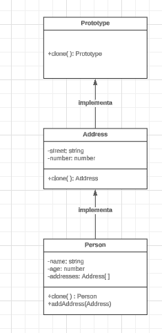
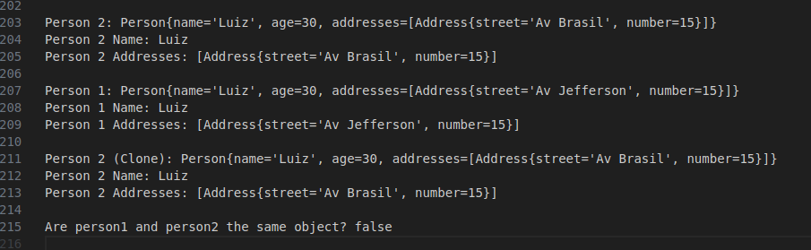

# Prototype

## Introdução

O padrão de projeto *Prototype* é um dos padrões criacionais definidos pela *Gang of Four* (GoF) no livro clássico *Design Patterns: Elements of Reusable Object-Oriented Software* (Gamma et al., 1994). Esse padrão permite a criação de novos objetos a partir de um protótipo existente, evitando a necessidade de recriação do objeto do zero e promovendo a reutilização de instâncias já configuradas. Segundo Freeman e Freeman (2004), o *Prototype* é ideal para situações em que a criação de objetos é custosa ou complexa.

## Definição e Propósito

De acordo com Gamma et al. (1994), o padrão *Prototype* tem como objetivo criar novos objetos clonando uma instância existente. Isso é útil para evitar a criação repetida de objetos "caros" e para permitir a criação de objetos com diferentes configurações sem a necessidade de muitas subclasses.

Freeman e Freeman (2004) destacam que o *Prototype* promove flexibilidade, permitindo que o cliente copie objetos existentes sem conhecer suas classes exatas. Essa abordagem também ajuda a evitar a explosão de subclasses ao encapsular o processo de clonagem em um método *clone*.

## Estrutura

O padrão é composto pelos seguintes elementos principais (Gamma et al., 1994):

1. *Prototype* (Interface Abstrata): Define o método *clone* que será implementado pelos protótipos concretos.
2. *Concrete Prototype* (Protótipos Concretos): Implementam a interface *Prototype* e contêm o método *clone* que permite a cópia de instâncias.
3. *Client* (Código Cliente): Responsável por solicitar a clonagem de objetos protótipos.

## Funcionamento

Freeman e Freeman (2004) explicam que o padrão *Prototype* é útil em cenários onde o processo de criação de objetos envolve várias etapas ou combinações de componentes. Por exemplo, ao criar um catálogo de produtos em um brechó online, pode ser necessário configurar categorias, métodos de pagamento e endereços de forma independente.

Assim, o *Prototype* é particularmente útil em situações em que:

- O processo de criação do objeto é custoso ou complexo.
- É necessário criar múltiplas variações de um objeto base.
- Existe a necessidade de ocultar a lógica de construção do cliente.

## Vantagens

Gamma et al. (1994) ressaltam que o *Prototype* oferece diversas vantagens:

- Reduz a necessidade de criar subclasses para cada configuração de objeto.
- Permite a criação de objetos complexos de forma eficiente.
- Oculta a lógica de construção do cliente.
- Promove a reutilização de instâncias existentes.

## Desvantagens

Embora poderoso, o *Prototype* pode introduzir complexidade adicional:

- Clonar objetos que possuem referências para outros objetos pode ser desafiador.
- Pode ser difícil implementar clonagem profunda em alguns cenários.
- A manutenção do código pode se tornar mais complexa quando muitos objetos precisam ser clonados.

## Aplicação

A aplicação do padrão de projeto em questão se deu em duas etapas: criação do diagrama UML e desenvolvimento do código. Cada etapa é descrita a seguir.

### Elaboração do Diagrama UML

O desenvolvimento do diagrama do padrão *Prototype* seguiu a estrutura apresentada no tópico [Estrutura](#estrutura). O diagrama apresentado na **Figura 1** abaixo refere-se à aplicação do padrão em um caso de uso fictício, relacionado ao tema do projeto UnBrechó.

<center>
<figcaption> 

**Figura 1** - Diagrama do padrão de projeto *Prototype*.

</figcaption>



<figcaption>

**Fonte:** <a href="https://github.com/ericcs10" target="_blank">Eric Camargo</a>, 2024.

</figcaption>
</center>

As estruturas, conforme definido no tópico [Estrutura](#estrutura), são aplicadas no diagrama como classes da seguinte forma:

1. *Prototype*: Interface *Prototype*.
2. *Concrete Prototype*: Classes *Product* e *Address*.
3. *Client*: Código responsável por clonar objetos protótipos no contexto do UnBrechó.

O caso de uso fictício foi incentivado pela proposta acadêmica do presente projeto, de modo que fosse possível explorar os diversos padrões existentes antes de escolher um padrão definitivo a ser implementado no UnBrechó.

---

Com base nessa abordagem teórica e prática, o padrão *Prototype* demonstrou ser uma solução eficaz para lidar com a criação de objetos complexos e a reutilização de instâncias existentes no projeto UnBrechó.

### Desenvolvimento do Código

A seguir, um exemplo prático do Adapter implementado em Java para integração com uma API de pagamento (PayPal), elaborado por [Douglas Marinho](https://github.com/M4RINH0), [Eric Camargo](https://github.com/Ericcs10) e [Henrique Torres](https://github.com/henriqtorresl):

- Main

```
package prototype;

public class Main {
    public static void main(String[] args) {
        Address address1 = new Address("Av Brasil", 15);

        Person person1 = new Person("Luiz", 30);
        person1.addAddress(address1);

        Person person2 = person1.clone();
    }
}
```

- Interface.

```
package prototype;

public interface Prototype {
    Prototype clone();
}
```

- Address

```
package prototype;

public class Address implements Prototype {
    private String street;
    private int number;

    // Construtor
    public Address(String street, int number) {
        this.street = street;
        this.number = number;
    }

    // Getter e Setter
    public String getStreet() {
        return street;
    }

    public void setStreet(String street) {
        this.street = street;
    }

    public int getNumber() {
        return number;
    }

    public void setNumber(int number) {
        this.number = number;
    }
}
```

- Person

```
package prototype;

import java.util.ArrayList;
import java.util.List;

public class Person implements Prototype {
    private String name;
    private int age;
    private List<Address> addresses;

    // Construtor
    public Person(String name, int age) {
        this.name = name;
        this.age = age;
        this.addresses = new ArrayList<>();
    }

    // Getter e Setter
    public String getName() {
        return name;
    }

    public void setName(String name) {
        this.name = name;
    }

    public int getAge() {
        return age;
    }

    public void setAge(int age) {
        this.age = age;
    }

    public List<Address> getAddresses() {
        return addresses;
    }

    public void addAddress(Address address) {
        this.addresses.add(address);
    }

    // Implementação do método clone
    @Override
    public Person clone() {
        Person newPerson = new Person(this.name, this.age);
        for (Address address : this.addresses) {
            newPerson.addAddress(address.clone());
        }
        return newPerson;
    }

    @Override
    public String toString() {
        return "Person{name='" + name + "', age=" + age + ", addresses=" + addresses + "}";
    }
}
```

- Clone

```
package prototype;

@Override
    public Address clone() {
        return new Address(this.street, this.number);
    }

    @Override
    public String toString() {
        return "Address{street='" + street + "', number=" + number + "}";
    }
```

<center>
<figcaption> 

**Figura 2** - Resultado da execução do código.

</figcaption>



<figcaption>

**Fonte:** <a href="https://github.com/ericcs10" target="_blank">Eric Camargo</a>, 2024.


</figcaption>
</center>

---

## Referências

> Gamma, E., Helm, R., Johnson, R., & Vlissides, J. (1994). **Design Patterns: Elements of Reusable Object-Oriented Software.** Addison-Wesley.

> [Refactoring Guru - Adapter](https://refactoring.guru/design-patterns/adapter)

> Freeman, E., Freeman, E., Bates, B., & Sierra, K. (2004). **Head First Design Patterns.** O'Reilly Media.

## Histórico de Versão

| Versão | Data       | Descrição                                                        | Autor(es)                                       | Revisor(es) | Resultado da Revisão |
| ------ | ---------- | ---------------------------------------------------------------- | ----------------------------------------------- | ----------- | -------------------- |
| 1.0    | 04/01/2025 | Criação do documento | [Douglas Marinho](https://github.com/M4RINH0), [Eric Camargo](https://github.com/Ericcs10) e [Henrique Torres](https://github.com/henriqtorresl) | [Ana Hoffmann](https://github.com/AnHoff) | Padronização do documento conforme padrão do projeto e abertura de PR. |