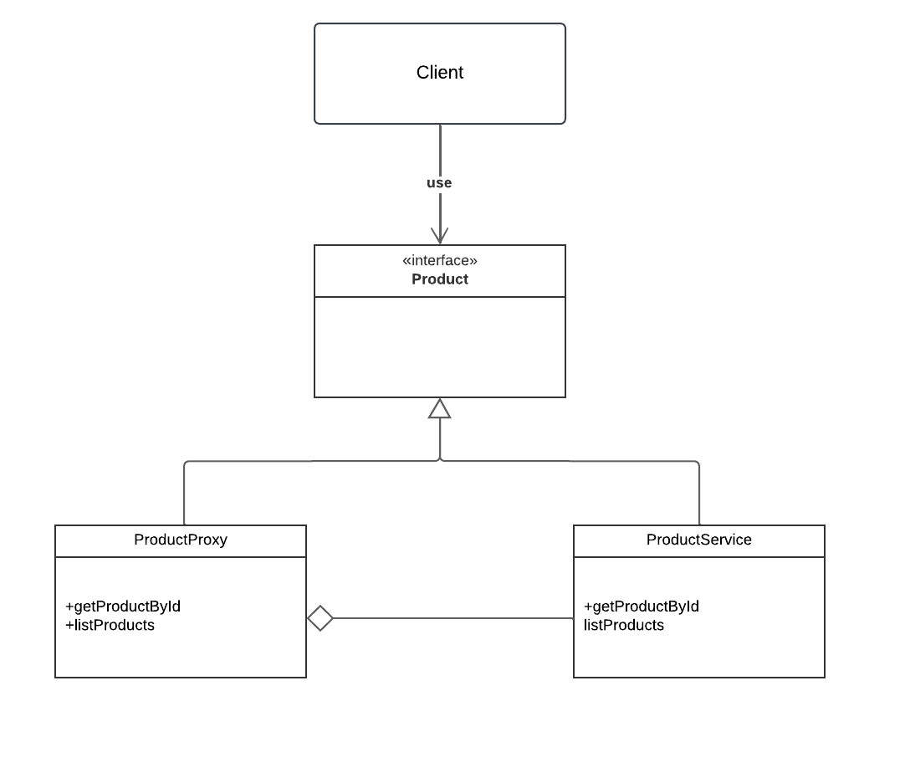

# Proxy

## Introdução

O padrão de projeto Proxy é uma solução de design que fornece um substituto ou representante para outro objeto. Ele é amplamente utilizado para controlar o acesso a um objeto, adicionando uma camada de abstração entre o cliente e o objeto real. O Proxy pode ser usado para propósitos como controle de acesso, otimização de desempenho (caching), e adição de funcionalidades sem modificar o objeto original.

---

## Definição e Propósito

O _Proxy_ é um padrão de projeto estrutural que age como um substituto para outro objeto para controlar o acesso a ele.

**Propósito:** Fornecer um nível de indirection (indireção) para controlar o acesso a um objeto, podendo adicionar funcionalidades sem alterar o objeto real.

---

## Estrutura

A estrutura do padrão Proxy consiste em:

1. **Subject (Sujeito):** Define a interface comum entre o Proxy e o objeto real.
2. **RealSubject (Objeto Real):** A implementação real do objeto que o Proxy representa.
3. **Proxy:** Implementa a interface do Subject e controla o acesso ao RealSubject.

---

## Funcionamento

1. O cliente interage com o Proxy, chamando métodos da interface do Subject.
2. O Proxy decide como e quando delegar as chamadas para o RealSubject.
3. O Proxy pode adicionar lógica antes ou depois de chamar o RealSubject.

---

## Vantagens

1. **Controle de Acesso:** Restringe ou gerencia o acesso ao objeto real.
2. **Otimização:** Permite caching de resultados, reduzindo chamadas repetidas para o objeto real.
3. **Desacoplamento:** Adiciona funcionalidades sem modificar o objeto original.

---

## Desvantagens

1. **Complexidade Adicional:** A introdução de um Proxy pode aumentar a complexidade do sistema.
2. **Sobrecarga de Desempenho:** Dependendo da implementação, o Proxy pode introduzir atrasos.

---

## Aplicação

O padrão Proxy é útil em diversas situações, como:

- Controle de acesso a recursos sensíveis.
- Cache de dados para melhorar o desempenho.
- Representação de objetos remotos ou pesados, como arquivos ou conexões de rede.

---
## Diagrama

<center>
<figcaption> 

**Figura 1** - Diagrama do padrão de projeto *Strategy*.

</figcaption>



<figcaption>

**Fonte:** <a href="https://github.com/MarcoTulioSoares" target="_blank">Marco Túlio</a>, 2025.

</figcaption>
</center>

O diagrama acima ilustra a aplicação do padrão Proxy em um sistema de processamento de produtos do brecho de uma loja virtual.
## Exemplo Prático

A seguir, um exemplo prático do Proxy implementado em TypeScript para gerenciar produtos de uma loja virtual:


- Interface.
```typescript
export interface Product {
  id: number;
  name: string;
  description: string;
  price: number;
  isAvailable: boolean;
}
```
- Proxy
```typescript
export class ProductProxy {
  private productService: ProductService;
  private cache: { [key: number]: Product | null } = {};

  constructor() {
    this.productService = new ProductService();
  }

  getProductById(id: number): Product | null {
    if (this.cache[id]) {
      console.log(`[ProductProxy] Cache encontrado para o produto ID: ${id}`);
      return this.cache[id];
    }

    console.log(`[ProductProxy] Cache não encontrado. Buscando do serviço.`);
    const product = this.productService.getProductById(id);
    this.cache[id] = product;
    return product;
  }

  listProducts(): Product[] {
    return this.productService.listProducts();
  }
}
```

- Service.
```typescript
export class ProductService {
  private products: Product[] = [
    { id: 1, name: "Blusa Vintage", description: "Blusa em ótimo estado.", price: 50, isAvailable: true },
    { id: 2, name: "Calça Jeans", description: "Calça com leve desgaste.", price: 70, isAvailable: false },
  ];

  getProductById(id: number): Product | null {
    console.log(`[ProductService] Buscando produto com ID: ${id}`);
    return this.products.find((product) => product.id === id) || null;
  }

  listProducts(): Product[] {
    console.log("[ProductService] Listando todos os produtos.");
    return this.products;
  }
}
```

## Referências
- REFACTORING GURU. Design Patterns: Proxy. Disponível em: https://refactoring.guru/pt-br/design-patterns/proxy. Acesso em: 5 jan. 2025

# Histórico de Versões

| Versão | Data       | Descrição            | Autor(es)                                        | Revisor(es) | Resultado da Revisão |
| ------ | ---------- | -------------------- | ------------------------------------------------ | ----------- | -------------------- |
| `1.0`  | 27/12/2024 | Criação do documento | [Marco Tulio](https://github.com/MarcoTulioSoares) |  |
| `1.0`  | 27/12/2024 | Codificação | [Valderson](https://github.com/valdersonjr)  |  |