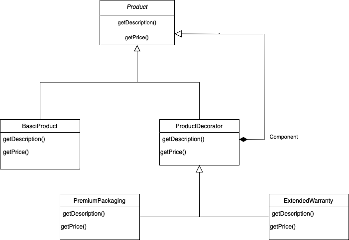

# Decorator

## Introdução

O padrão de projeto *Decorator* é um dos padrões estruturais definidos pela *Gang of Four* (GoF) no livro clássico *Design Patterns: Elements of Reusable Object-Oriented Software* (Gamma et al., 1994). Ele é utilizado para adicionar comportamentos ou responsabilidades a objetos individuais dinamicamente, sem modificar sua estrutura original.

## Definição e Propósito

O *Decorator* tem como objetivo permitir que responsabilidades adicionais sejam atribuídas a um objeto de forma dinâmica, oferecendo uma alternativa flexível à herança para a extensão de funcionalidades. Isso é útil em situações em que várias combinações de comportamentos diferentes precisam ser aplicadas a objetos sem criar subclasses excessivas.

O padrão *Decorator* é similar ao conceito de "envoltórios" ou "camadas" ao redor de um objeto, onde cada camada adiciona funcionalidades ou modifica o comportamento existente. Ao contrário de abordagens baseadas em herança, os decoradores trabalham com composição, tornando o código mais flexível e modular.

Linguagens de programação como Python e Java oferecem suporte direto ou indireto para o padrão *Decorator*. No Python, decoradores são uma funcionalidade nativa utilizada para modificar ou estender o comportamento de funções e métodos.

<br>
<center>
<figcaption> 

**Figura 1** - Explicação do *Decorator*.


**Fonte:** <a href="https://refactoring.guru/design-patterns/decorator" target="_blank">Refactoring Guru</a>, 2025.

</figcaption>
</center>

## Estrutura

A organização do padrão *Decorator* é composta pelos seguintes elementos:

1. **Componente**: Define a interface compartilhada por todos os objetos, incluindo os que serão decorados e os próprios decoradores.

2. **Componente Concreto**: Representa a classe que implementa o comportamento padrão dos objetos a serem decorados. Esse comportamento pode ser estendido dinamicamente por meio dos decoradores.

3. **Decorador Base**: Uma classe que encapsula outro objeto, referenciando-o através de um campo que segue a interface do componente. Isso permite que tanto objetos concretos quanto decoradores sejam armazenados e manipulados de maneira uniforme. O decorador base redireciona as operações para o objeto encapsulado.

4. **Decoradores Concretos**: São extensões específicas do decorador base, que adicionam ou modificam funcionalidades. Eles implementam lógica adicional antes ou depois de delegar as chamadas ao objeto encapsulado.

5. **Cliente**: É responsável por combinar objetos e decoradores em diferentes configurações, mantendo sempre a interação por meio da interface do componente. Isso possibilita empilhar múltiplas camadas de decoradores, criando comportamentos complexos de maneira flexível.

## Utilidade do Decorator

- Quando é necessário adicionar funcionalidades a objetos de forma dinâmica, sem alterar sua estrutura original;
- Ideal para situações em que diferentes combinações de comportamentos precisam ser aplicadas a objetos, evitando a criação de múltiplas subclasses;
- Permite adicionar ou modificar funcionalidades em tempo de execução, adaptando o comportamento dos objetos conforme a necessidade.

## Vantagens do Decorator

- **Flexibilidade**: Permite estender funcionalidades sem alterar a classe original ou afetar outros objetos;
- **Composição**: Estimula a composição sobre a herança, tornando o código mais modular e reutilizável;
- **Camadas de Funcionalidade**: Facilita a aplicação de múltiplas responsabilidades ou comportamentos ao mesmo objeto, combinando decoradores de maneira flexível.

## Desvantagens do Decorator

- **Complexidade Adicional**: A introdução de decoradores pode tornar o código mais difícil de compreender e manter, devido ao aumento no número de classes;
- **Depuração Difícil**: A cadeia de chamadas entre decoradores e o objeto original pode dificultar a identificação de problemas;
- **Sobrecarga de Configuração**: Aplicar muitos decoradores a um único objeto pode resultar em sobrecarga de configuração e aumento na complexidade de gerenciamento.

## Aplicação do Decorator

A aplicação do padrão de projeto levou em conta o cenário de uso do controle de acesso no brechó.

### Elaboração do Diagrama

O desenvolvimento do diagrama do padrão de projeto _Decorator_ deve envolver as cinco estruturas apresentadas no tópico [Estrutura](#estrutura). O diagrama apresentado na **Figura 1** abaixo se refere à aplicação do padrão _Decorator_ em um caso de uso fictício, relacionado ao tema do trabalho do Grupo 02: UnBrechó.

<center>
<figcaption>

**Figura 1** - Diagrama do padrão de projeto _Decorator_.

</figcaption>



<figcaption>

**Fonte:** <a href="https://github.com/guinuto" target="_blank">Guilherme Evangelista</a> e <a href="https://github.com/luizpettengill" target="_blank">Luiz Guilherme</a>, 2025.

</figcaption>
</center>

A utilização de um caso de uso fictício foi incentivada pela proposta acadêmica do presente projeto, de modo que fosse possível estudar os diversos padrões existentes antes de escolher um padrão definitivo a ser utilizado no projeto do UnBrechó.

As estruturas, conforme definido no tópico [Estrutura](#estrutura), são aplicadas no diagrama da seguinte forma:

1. _Component_: Product.

2. _Concrete Component_: BasicProduct.

3. _Decorator Abstrato_: ProductDecorator.

4. _Concrete Decorator_: PremiumPackaging e ExtendedWarranty

### Desenvolvimento do Código

O desenvolvimento do código para aplicação prática do padrão de projeto *Decorator* foi feito utilizando a linguagem de programação Python e, para executá-lo, deve-se seguir os passos a seguir:

1. Entrar na pasta code/decorator/

2. Ter instalado o node/npm

3. Executar o projeto com o comando npm start

O resultado da execução dos comandos deve ser um output no console com produtos de acordo com a garantia e forma de entrega.

<center>
<figcaption>

**Figura 2** - Resultado da execução do script.


**Fonte:** <a href="https://github.com/eduard0803" target="_blank">Eduardo Belarmino</a> e <a href="https://github.com/guinuto" target="_blank">Guilherme Evangelista</a>, 2025.

</center>


- Decorator abstrato.

```js
const Product = require('./Product');
class ProductDecorator extends Product {
    constructor(product) {
        super();
        this.product = product;
    }

    getDescription() {
        return this.product.getDescription();
    }

    getPrice() {
        return this.product.getPrice();
    }
}

module.exports = ProductDecorator;
```

- Decorator concreto.

```js
const ProductDecorator = require('./ProductDecorator');

class PremiumPackaging extends ProductDecorator {
    getDescription() {
        return this.product.getDescription() + " + Embalagem Premium";
    }

    getPrice() {
        return this.product.getPrice() + 10.0;
    }
}

module.exports = PremiumPackaging;
```

- Classe para representar o concrete component

```js
const Product = require('./Product');
class BasicProduct extends Product {
    getDescription() {
        return "Produto Base";
    }

    getPrice() {
        return 50.0;
    }
}

module.exports = BasicProduct;
```

- Main.

```js
const BasicProduct = require('./BasicProduct');
const ExtendedWarranty = require('./ExtendedWarranty');
const PremiumPackaging = require('./PremiumPackaging');

// 🚀 Teste do Padrão Decorator
function main() {
    // Produto Base
    let product = new BasicProduct();
    console.log(`${product.getDescription()} - R$${product.getPrice()}`);

    // Adiciona Garantia Estendida
    product = new ExtendedWarranty(product);
    console.log(`${product.getDescription()} - R$${product.getPrice()}`);

    // Adiciona Embalagem Premium
    product = new PremiumPackaging(product);
    console.log(`${product.getDescription()} - R$${product.getPrice()}`);
}

// 🎯 Executa o teste
main();
```


## Referências

> Gamma, E., Helm, R., Johnson, R., & Vlissides, J. (1994). Design Patterns: Elements of Reusable Object-Oriented Software. Addison-Wesley.

> Decorator. Refactoring Guru, 2025. Disponível em: <https://refactoring.guru/design-patterns/decorator>. Acesso em: 03 jan. de 2025.

## Histórico de Versão

| Versão | Data       | Descrição            | Autor(es)                                        | Revisor(es) | Resultado da Revisão |
| ------ | ---------- | -------------------- | ------------------------------------------------ | ----------- | -------------------- |
| `1.0`  | 03/01/2025 | Criação do documento | [Eduardo Belarmino](https://github.com/eduard0803) | [Lucas Spinosa](https://github.com/LucasSpinosa) | Aprovado para merge |
| `1.1`  | 03/01/2025 | Adição do código de exemplo | [Eduardo Belarmino](https://github.com/eduard0803) | [Lucas Spinosa](https://github.com/LucasSpinosa) | Aprovado para merge |
| `1.2`  | 05/01/2025 | Ajuste de código do exemplo | [Guilherme Evangelista](https://github.com/guinuto) , [Luiz Guilherme](https://github.com/luizpettengill) | [Ana Hoffmann](https://github.com/AnHoff) | --- |
| `1.3`  | 06/01/2025 | Adição do diagrama | [Guilherme Evangelista](https://github.com/guinuto) , [Luiz Guilherme](https://github.com/luizpettengill) | [Ana Hoffmann](https://github.com/AnHoff) | Aprovação de PR, padronização do documento |
