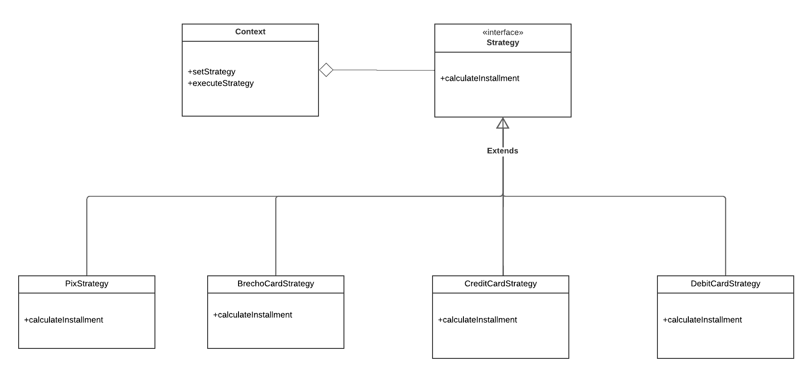
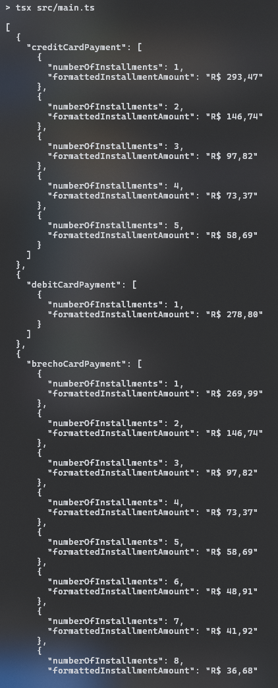

# Strategy

## Introdução

O padrão de projeto *Strategy* é um dos padrões comportamentais descritos no livro clássico Design Patterns: Elements of Reusable Object-Oriented Software (Gamma et al., 1994). Este padrão é utilizado para definir uma família de algoritmos, encapsulá-los em classes separadas e torná-los intercambiáveis. Ele promove a separação de responsabilidades, permitindo que diferentes algoritmos sejam selecionados em tempo de execução sem alterar o código do cliente.

## Definição e Propósito

De acordo com Gamma et al. (1994), o padrão *Strategy* permite que diferentes algoritmos ou comportamentos sejam definidos como classes separadas e que o objeto que os utiliza seja capaz de selecionar o algoritmo desejado de forma dinâmica. Essa abordagem promove a substituição de comportamentos em tempo de execução sem modificar a estrutura geral do sistema.

Freeman e Freeman (2004) destacam que o *Strategy* é útil em situações onde há necessidade de alternar entre diferentes comportamentos ou quando se deseja evitar estruturas condicionais complexas, como grandes blocos de código if-else.

## Estrutura

O padrão *Strategy* é composto pelos seguintes elementos principais (Gamma et al., 1994):

1. *Strategy* (Interface ou Classe Abstrata): Define a interface comum para todos os algoritmos.

2. *Concrete Strategies* (Implementações Concretas): Implementam a interface definida por *Strategy*, fornecendo diferentes variações do algoritmo.

3. *Context*: Contém uma referência para um objeto *Strategy* e delega a ele a execução do algoritmo.

## Funcionamento

Freeman e Freeman (2004) explicam que o padrão *Strategy* é útil para evitar duplicação de código e tornar o sistema mais extensível.

## Vantagens

Gamma et al. (1994) destacam os seguintes benefícios do padrão *Strategy*:

- Redução de complexidade: Elimina grandes estruturas condicionais no código.

- Extensibilidade: Novos algoritmos podem ser adicionados sem modificar o código existente.

- Reutilização: Cada algoritmo é isolado em sua própria classe, promovendo reutilização em diferentes contextos.

Freeman e Freeman (2004) enfatizam que o *Strategy* é especialmente útil em sistemas que devem lidar com múltiplas variações de comportamento, garantindo flexibilidade e mantendo o código organizado.

## Desvantagens

Embora seja uma solução interessante, o padrão *Strategy* também apresenta algumas desvantagens:

- Complexidade adicional: Introduz mais classes no sistema, o que pode ser excessivo para problemas simples (Freeman & Freeman, 2004).

- Dependência do Context: O cliente precisa estar ciente da existência de múltiplas estratégias e de como configurá-las.

## Aplicação

A aplicação do padrão de projeto em questão se deu em duas etapas: criação do diagrama e desenvolvimento do código. Cada etapa pode ser conferida em detalhes a seguir.

### Elaboração do Diagrama

O desenvolvimento do diagrama do padrão de projeto *Strategy* deve envolver as três estruturas apresentadas no tópico [Estrutura](#estrutura). O diagrama apresentado na **Figura 1** abaixo se refere à aplicação do padrão *Strategy* em um caso de uso fictício, relacionado ao tema do trabalho do Grupo 02: UnBrechó.

<center>
<figcaption> 

**Figura 1** - Diagrama do padrão de projeto *Strategy*.

</figcaption>



<figcaption>

**Fonte:** <a href="https://github.com/MarcoTulioSoares" target="_blank">Marco Túlio</a>, 2025.

</figcaption>
</center>

A utilização de um caso de uso fictício foi incentivada pela proposta acadêmica do presente projeto, de modo que fosse possível estudar os diversos padrões existentes antes de escolher um padrão definitivo a ser utilizado no projeto do UnBrechó.

As estruturas do *Strategy*, conforme definido no tópico [Estrutura](#estrutura), são aplicadas no diagrama da seguinte forma:

1. *Strategy*: Strategy.

2. *Concrete Strategies*: PixStrategy, BrechoCardStrategy, CreditCardStrategy, DebitCardStrategy.

3. *Context*: Context.

### Desenvolvimento do Código

O desenvolvimento do código para aplicação prática do padrão de projeto *Strategy* foi feito de acordo com o [Diagrama](#elaboração-do-diagrama) apresentado. Foi utilizada a linguagem de programação Typescript e, para executá-lo, deve-se seguir os passos a seguir:

1. Entrar na pasta code/builder/src/strategy.

2. Ter instalado o npm (comando: *npm install*).

3. Executar o projeto com o comando *npm run start*.

O resultado da execução dos comandos acima deve ser uma saída contendo a representação dos tipos de pagamentos criados, cada um com suas distintas características.

Para fins de visualização sem execução de código ou utilização de linhas de comando, confira as linhas de código abaixo.

- Main

```ts
import { ExampleApplication } from "./exampleApplication";

const app = new ExampleApplication();

const creditCardPayment = app.main("credit_card", 293.47);
const debitCardPayment = app.main("debit_card", 293.47);
const brechoCardPayment = app.main("brecho_card", 293.47);
const pixPayment = app.main("pix", 293.47);

console.log(
  JSON.stringify(
    [
      { creditCardPayment },
      { debitCardPayment },
      { brechoCardPayment },
      { pixPayment },
    ],
    null,
    2
  )
);
```

- Exemplo de aplicação

```ts
import { Context } from "./context";
import { PaymentMethod } from "./shared/types";
import { BrechoCardStrategy } from "./strategies/brechoCardStrategy";
import { CreditCardStrategy } from "./strategies/creditCardStrategy";
import { DebitCardStrategy } from "./strategies/debitCardStrategy";
import { PixStrategy } from "./strategies/pixStrategy";

export class ExampleApplication {
  context: Context;
  main(paymentMethod: PaymentMethod, orderTotal: number) {
    switch (paymentMethod) {
      case "credit_card":
        this.context = new Context(new CreditCardStrategy());
        break;
      case "debit_card":
        this.context = new Context(new DebitCardStrategy());
        break;
      case "brecho_card":
        this.context = new Context(new BrechoCardStrategy());
        break;
      case "pix":
        this.context = new Context(new PixStrategy());
        break;
      default:
        throw new Error("Invalid payment method");
    }

    return this.context.executeStrategy(orderTotal);
  }
}
```

- Context

```ts
import { InstallmentResult, NonEmptyArray } from "./shared/types";
import { Strategy } from "./strategies/strategy";

export class Context {
  private strategy: Strategy;

  constructor(strategy: Strategy) {
    this.strategy = strategy;
  }

  setStrategy(strategy: Strategy) {
    this.strategy = strategy;
  }

  executeStrategy(orderTotal: number): NonEmptyArray<InstallmentResult> {
    return this.strategy.calculateInstallment(orderTotal);
  }
}
```

- Strategy

```ts
import { InstallmentResult, NonEmptyArray } from "../shared/types";

export interface Strategy {
  calculateInstallment(orderTotal: number): NonEmptyArray<InstallmentResult>;
}
```

- brechoCardStrategy

```ts
import { calculateInstallmentsFromSecondToMaxInstallments } from "../shared/calculateInstallments";
import { formatAmountBRL } from "../shared/formatAmount.";
import { InstallmentResult, NonEmptyArray } from "../shared/types";
import { Strategy } from "./strategy";
import Big from "big.js";

// For payments using brecho card we offer the following conditions:
// 8% discount in one installment
// or
// until 24 installments with minimum installment of 20
export class BrechoCardStrategy implements Strategy {
  private readonly ONE_INSTALLMENT_DISCOUNT_PERCENTAGE = 0.08;
  private readonly MINIMUM_INSTALLMENT_AMOUNT = 20;
  private readonly MAX_INSTALLMENTS = 24;
  calculateInstallment(orderTotal: number): NonEmptyArray<InstallmentResult> {
    const maxInstallments = Math.min(
      this.MAX_INSTALLMENTS,
      Math.floor(orderTotal / this.MINIMUM_INSTALLMENT_AMOUNT)
    );

    const installments: NonEmptyArray<InstallmentResult> = [
      {
        numberOfInstallments: 1,
        formattedInstallmentAmount: formatAmountBRL(
          new Big(orderTotal)
            .times(1 - this.ONE_INSTALLMENT_DISCOUNT_PERCENTAGE)
            .toFixed(2)
        ),
      },
      ...calculateInstallmentsFromSecondToMaxInstallments(
        orderTotal,
        maxInstallments
      ),
    ];

    return installments;
  }
}
```

- creditCardStrategy

```ts
import { calculateInstallmentsFromSecondToMaxInstallments } from "../shared/calculateInstallments";
import { formatAmountBRL } from "../shared/formatAmount.";
import { InstallmentResult, NonEmptyArray } from "../shared/types";
import { Strategy } from "./strategy";
import Big from "big.js";

// For payments using credit card we offer until 5 installments with minimum installment of 50
export class CreditCardStrategy implements Strategy {
  private readonly MINIMUM_INSTALLMENT_AMOUNT = 50;
  private readonly MAX_INSTALLMENTS = 5;
  calculateInstallment(orderTotal: number): NonEmptyArray<InstallmentResult> {
    const maxInstallments = Math.min(
      this.MAX_INSTALLMENTS,
      Math.floor(orderTotal / this.MINIMUM_INSTALLMENT_AMOUNT)
    );

    const installments: NonEmptyArray<InstallmentResult> = [
      {
        numberOfInstallments: 1,
        formattedInstallmentAmount: formatAmountBRL(
          new Big(orderTotal).toFixed(2)
        ),
      },
      ...calculateInstallmentsFromSecondToMaxInstallments(
        orderTotal,
        maxInstallments
      ),
    ];

    return installments;
  }
}
```

- debitCardStrategy

```ts
import { formatAmountBRL } from "../shared/formatAmount.";
import { InstallmentResult, NonEmptyArray } from "../shared/types";
import { Strategy } from "./strategy";
import Big from "big.js";

// For payments using the debit card we offer a 5% discount on the total amount
export class DebitCardStrategy implements Strategy {
  private readonly DISCOUNT_PERCENTAGE = 0.05;

  calculateInstallment(orderTotal: number): NonEmptyArray<InstallmentResult> {
    return [
      {
        numberOfInstallments: 1,
        formattedInstallmentAmount: formatAmountBRL(
          new Big(orderTotal).times(1 - this.DISCOUNT_PERCENTAGE).toFixed(2)
        ),
      },
    ];
  }
}
```

- calculateInstallments

```ts
import Big from "big.js";
import { formatAmountBRL } from "./formatAmount.";
import { InstallmentResult } from "./types";

// Couldn't think about a better name for this function :(
export const calculateInstallmentsFromSecondToMaxInstallments = (
  orderTotal: number,
  maxInstallments: number
) => {
  const installments: InstallmentResult[] = [];

  for (let installment = 2; installment <= maxInstallments; installment++) {
    installments.push({
      numberOfInstallments: installment,
      formattedInstallmentAmount: formatAmountBRL(
        new Big(orderTotal).div(installment).toFixed(2)
      ),
    });
  }

  return installments;
};
```

- formatAmount

```ts
export const formatAmountBRL = (amount: string): string => {
  return `R$ ${amount
    .replace(".", ",")
    .replace(/(\d)(?=(\d{3})+(?!\d))/g, "$1.")}`;
};
```

- types

```ts
export type PaymentMethod =
  | "credit_card"
  | "debit_card"
  | "brecho_card"
  | "pix";

export type InstallmentResult = {
  numberOfInstallments: number;
  formattedInstallmentAmount: string;
};

export type NonEmptyArray<T> = [T, ...T[]];
```

<center>
<figcaption> 

**Figura 2** - Resultado da execução do código.

</figcaption>



<figcaption>

**Fonte:** <a href="https://github.com/marrcelo" target="_blank">Marcelo Magalhães</a>, 2025.

</figcaption>
</center>

## Referências

> Gamma, E., Helm, R., Johnson, R., & Vlissides, J. (1994). Design Patterns: Elements of Reusable Object-Oriented Software. Addison-Wesley.

> Freeman, E., & Freeman, E. (2004). Head First Design Patterns. O'Reilly Media.

> Fowler, M. (2002). Patterns of Enterprise Application Architecture. Addison-Wesley.

## Histórico de Versão

| Versão | Data       | Descrição            | Autor(es)                                        | Revisor(es) | Resultado da Revisão |
| ------ | ---------- | -------------------- | ------------------------------------------------ | ----------- | -------------------- |
| `1.0`  | 01/01/2025 | Criação do documento | [Ana Hoffmann](https://github.com/AnHoff), [Marco Túlio](https://github.com/MarcoTulioSoares) e [Marcelo Magalhães](https://github.com/marrcelo) | [Ana Hoffmann](https://github.com/AnHoff) | ---                  |
| `1.1`  | 02/01/2025 | Adição de imagens do código | [Ana Hoffmann](https://github.com/AnHoff), [Marco Túlio](https://github.com/MarcoTulioSoares) e [Marcelo Magalhães](https://github.com/marrcelo) | [Ana Hoffmann](https://github.com/AnHoff) | ---                  |
| `1.2`  | 03/01/2025 | Adição de imagem do diagrama | [Ana Hoffmann](https://github.com/AnHoff), [Marco Túlio](https://github.com/MarcoTulioSoares) e [Marcelo Magalhães](https://github.com/marrcelo) | [Ana Hoffmann](https://github.com/AnHoff) | Formatação do código, aprovação de PR. |