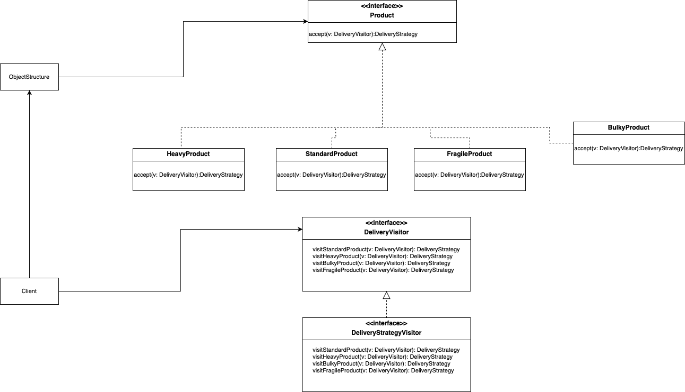
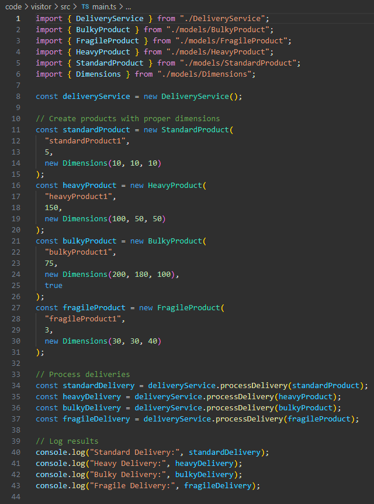
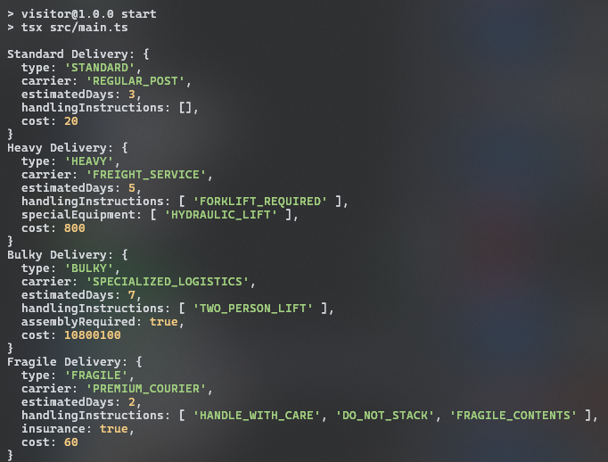

# Visitor

## Introdução

O padrão de projeto *Visitor* é um dos padrões comportamentais descritos no livro clássico Design Patterns: Elements of Reusable Object-Oriented Software (Gamma et al., 1994). Ele é utilizado para separar algoritmos da estrutura de dados sobre a qual eles operam, permitindo que novas operações sejam adicionadas a uma estrutura de objetos sem modificar as classes dessa estrutura. Este padrão é particularmente útil em sistemas que possuem hierarquias de objetos complexas e que precisam de flexibilidade para realizar operações variadas.

## Definição e Propósito

De acordo com Gamma et al. (1994), o padrão *Visitor* permite definir uma nova operação sobre uma estrutura de objetos sem alterar as classes que compõem essa estrutura. Isso é feito através da introdução de um objeto "visitante" que encapsula as operações a serem realizadas. O objetivo principal é facilitar a extensão das operações em uma estrutura de objetos, promovendo a separação de responsabilidades.

Freeman e Freeman (2004) destacam que o padrão é útil em situações onde se deseja aplicar diferentes tipos de processamento a uma coleção de objetos relacionados sem modificar suas classes individuais.

## Estrutura

O padrão *Visitor* é composto pelos seguintes elementos principais (Gamma et al., 1994):

- *Visitor* (Interface ou Classe Abstrata): Define a interface para as operações que podem ser realizadas em elementos da estrutura.

- *Concrete Visitor* (Visitante Concreto): Implementa as operações definidas pela interface *Visitor*. Cada visitante concreto pode oferecer uma operação específica.

- *Element* (Interface ou Classe Abstrata): Define uma interface que aceita um objeto *Visitor*.

- *Concrete Elements* (Elementos Concretos): Implementam a interface *Element* e delegam a operação ao *Visitor*.

- *Object Structure* (Estrutura de Objetos): Representa a coleção de objetos que podem ser visitados.

## Funcionamento

Freeman e Freeman (2004) explicam que o padrão Visitor é útil para realizar operações complexas sobre uma estrutura de objetos sem alterar suas classes.

## Vantagens

Gamma et al. (1994) destacam os seguintes benefícios do padrão *Visitor*:

- Facilidade de extensão: Novas operações podem ser adicionadas facilmente sem modificar as classes de elementos.

- Separação de responsabilidades: A lógica da operação é separada da estrutura de dados.

- Flexibilidade: Permite aplicar operações complexas ou específicas sem impactar a hierarquia de classes.

## Desvantagens

Apesar de suas vantagens, o padrão *Visitor* apresenta limitações:

- Complexidade adicional: Requer a criação de muitas classes para cada operação e elemento.

- Dependência de estruturas estáveis: Qualquer mudança na estrutura de objetos pode exigir modificações significativas nos visitantes existentes (Freeman & Freeman, 2004).

## Aplicação

A aplicação do padrão de projeto em questão se deu em duas etapas: criação do diagrama e desenvolvimento do código. Cada etapa pode ser conferida em detalhes a seguir.

### Elaboração do Diagrama

O desenvolvimento do diagrama do padrão de projeto *Visitor* deve envolver as estruturas apresentadas no tópico [Estrutura](#estrutura). O diagrama apresentado na **Figura 1** abaixo se refere à aplicação do padrão *Visitor* em um caso de uso fictício, relacionado ao tema do trabalho do Grupo 02: UnBrechó.

<figcaption> 

**Figura 1** - Diagrama do padrão de projeto *Visitor*.

</figcaption>

<figcaption>

**Fonte:** <a href="https://github.com/guinuto" target="_blank">Guilherme Evangelista</a>, 2024.

</figcaption>

A utilização de um caso de uso fictício foi incentivada pela proposta acadêmica do presente projeto, de modo que fosse possível estudar os diversos padrões existentes antes de escolher um padrão definitivo a ser utilizado no projeto do UnBrechó.

As estruturas, conforme definido no tópico [Estrutura](#estrutura), são aplicadas no diagrama da seguinte forma:

### Desenvolvimento do Código

O desenvolvimento do código para aplicação prática do padrão de projeto *Visitor* foi feito de acordo com o [Diagrama](#elaboração-do-diagrama) apresentado. Foi utilizada a linguagem de programação Typescript e, para executá-lo, deve-se seguir os passos a seguir:

1. Entrar na pasta code/builder/src

2. Ter instalado o npm (comando: *npm install*)

3. Executar o projeto com o comando *npm run start*

O resultado da execução dos comandos acima deve ser uma saída contendo a representação dos produtos criados, cada um com suas distintas características.

Para fins de visualização sem execução de código ou utilização de linhas de comando, confira as Figuras de 2 a 5 abaixo.

<figcaption> 

**Figura 2** - Código *Main* do *Visitor*.

</figcaption>

<figcaption>

**Fonte:** <a href="https://github.com/marrcelo" target="_blank">Marcelo Magalhães</a>, 2024.

</figcaption>

<figcaption> 

**Figura 6** - Resultado da execução do código.

</figcaption>

<figcaption>

**Fonte:** <a href="https://github.com/marrcelo" target="_blank">Marcelo Magalhães</a>, 2024.

</figcaption>

## Referências

Gamma, E., Helm, R., Johnson, R., & Vlissides, J. (1994). Design Patterns: Elements of Reusable Object-Oriented Software. Addison-Wesley.

Freeman, E., & Freeman, E. (2004). Head First Design Patterns. O'Reilly Media.

Fowler, M. (2002). Patterns of Enterprise Application Architecture. Addison-Wesley.

## Histórico de Versão

| Versão | Data       | Descrição            | Autor(es)                                        | Revisor(es) | Resultado da Revisão |
| ------ | ---------- | -------------------- | ------------------------------------------------ | ----------- | -------------------- |
| `1.0`  | 02/01/2024 | Criação do documento | [Ana Hoffmann](https://github.com/AnHoff), [Marcelo Magalhães](https://github.com/marrcelo) e [Guilherme Evangelista](https://github.com/guinuto) | ---         | ---                  |