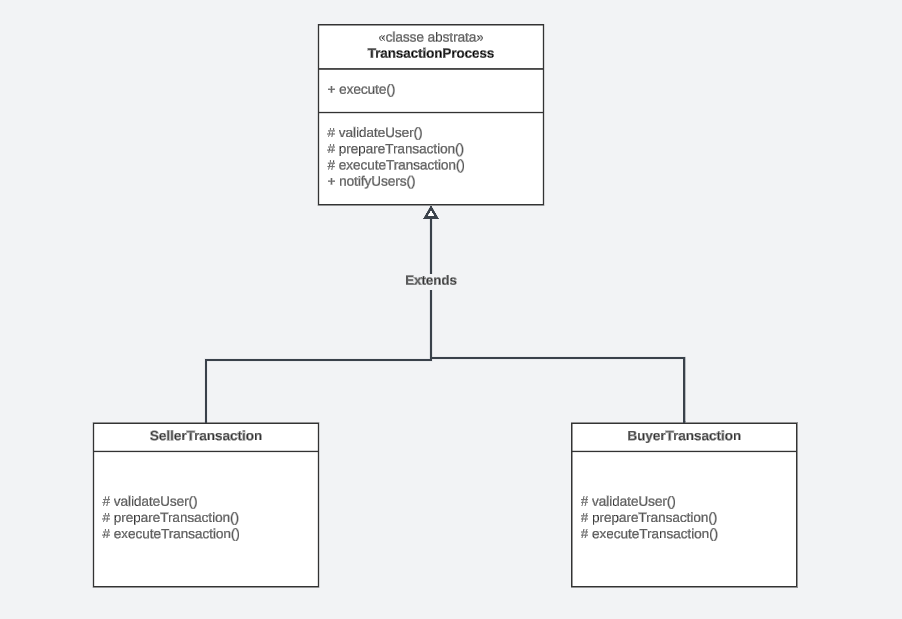
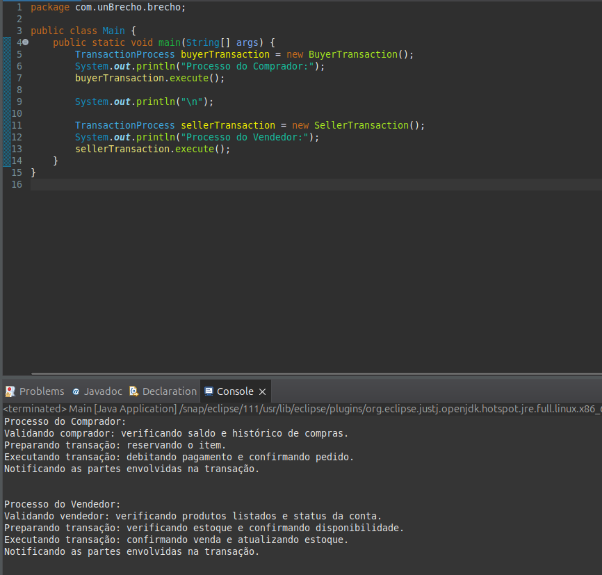

# Template Method

## Introdução

O padrão de projeto _Template Method_ é um dos padrões comportamentais descritos no livro clássico _Design Patterns: Elements of Reusable Object-Oriented Software_ (Gamma et al., 1994). Este padrão define o esqueleto de um algoritmo em um método, permitindo que algumas etapas do algoritmo sejam redefinidas em subclasses. O Template Method promove a reutilização de código, permitindo que a estrutura principal do algoritmo seja definida uma vez, enquanto as etapas específicas podem ser personalizadas.

## Definição e Propósito

De acordo com Gamma et al. (1994), o padrão _Template Method_ define a estrutura de um algoritmo, deixando alguns passos para que sejam implementados pelas subclasses. Ele permite que o comportamento de um algoritmo seja parcialmente definido e, em seguida, ajustado por subclasses sem modificar a estrutura principal do método.

Freeman e Freeman (2004) destacam que o _Template Method_ é útil quando há a necessidade de garantir que o esqueleto de um algoritmo seja mantido, mas permitindo que diferentes variantes de comportamento sejam implementadas por subclasses.

## Estrutura

O padrão _Template Method_ é composto pelos seguintes elementos principais (Gamma et al., 1994):

1. _Template Method_: Define o esqueleto do algoritmo, com chamadas para métodos abstratos que serão implementados pelas subclasses.

2. _Abstract Class_: Contém o método template e declara os métodos que podem ser sobrescritos pelas subclasses.

3. _Concrete Class_: Implementa os métodos abstratos definidos pela classe abstrata, proporcionando variações específicas do comportamento.

## Funcionamento

Freeman e Freeman (2004) explicam que o padrão _Template Method_ é útil quando se deseja fornecer uma estrutura básica para um algoritmo, permitindo que as subclasses definam comportamentos específicos sem alterar o fluxo principal do processo.

## Vantagens

Gamma et al. (1994) destacam os seguintes benefícios do padrão _Template Method_:

- **Reutilização de código**: O esqueleto do algoritmo é definido uma vez, o que reduz a duplicação de código.
- **Extensibilidade**: O algoritmo básico pode ser facilmente estendido e modificado em subclasses.
- **Controle**: O controle do fluxo principal do algoritmo é mantido pela classe base, enquanto as subclasses controlam o comportamento específico.

Freeman e Freeman (2004) enfatizam que o _Template Method_ é ideal quando há etapas comuns em um processo que não devem ser alteradas, mas podem ser ajustadas em partes específicas.

## Desvantagens

Embora o padrão _Template Method_ seja uma solução poderosa, ele também apresenta algumas desvantagens:

- **Rigidez**: O fluxo do algoritmo é rigidamente definido pela classe base, o que pode limitar a flexibilidade em alguns cenários.
- **Excesso de subclasses**: Pode levar ao aumento do número de classes no sistema, especialmente quando são necessárias várias variantes de comportamento.

## Aplicação

A aplicação do padrão de projeto _Template Method_ se deu em duas etapas: criação do diagrama e desenvolvimento do código. Cada etapa pode ser conferida em detalhes a seguir.

### Elaboração do Diagrama

O desenvolvimento do diagrama do padrão de projeto _Template Method_ deve envolver as três estruturas apresentadas no tópico [Estrutura](#estrutura). O diagrama apresentado na **Figura 1** abaixo se refere à aplicação do padrão _Template Method_ em um caso de uso fictício, relacionado ao tema do trabalho do Grupo 02: UnBrechó.

<center>
<figcaption>

**Figura 1** - Diagrama do padrão de projeto _Template Method_.

</figcaption>



<figcaption>

**Fonte:**
<a href="https://github.com/henriqtorresl" target="_blank">Henrique Torres</a>,
<a href="https://github.com/M4RINH0" target="_blank">Douglas Marinho</a> e
<a href="https://github.com/Ericcs10" target="_blank">Eric Camargo</a>, 2024.

</figcaption>
</center>

As estruturas do _Template Method_, conforme definido no tópico [Estrutura](#estrutura), são aplicadas no diagrama da seguinte forma:

1. _Template Method_: TransactionProcess.execute().
2. _Abstract Class_: TransactionProcess.
3. _Concrete Class_: SellerTransaction, BuyerTransaction.

### Desenvolvimento do Código

A seguir, um exemplo prático do Template Method implementado em Java para o tratamento de tipos diferentes de transações:

- TransactionProcess

```java
package com.unBrecho.brecho;

public abstract class TransactionProcess {

    public final void execute() {
        validateUser();
        prepareTransaction();
        executeTransaction();
        notifyUsers();
    }

    protected abstract void validateUser();
    protected abstract void prepareTransaction();
    protected abstract void executeTransaction();


    protected void notifyUsers() {
        System.out.println("Notificando as partes envolvidas na transação.");
    }
}
```

- SellerTransaction

```java
package com.unBrecho.brecho;

public class SellerTransaction extends TransactionProcess {
    @Override
    protected void validateUser() {
        System.out.println("Validando vendedor: verificando produtos listados e status da conta.");
    }

    @Override
    protected void prepareTransaction() {
        System.out.println("Preparando transação: verificando estoque e confirmando disponibilidade.");
    }

    @Override
    protected void executeTransaction() {
        System.out.println("Executando transação: confirmando venda e atualizando estoque.");
    }
}
```

- BuyerTransaction

```java
package com.unBrecho.brecho;

public class BuyerTransaction extends TransactionProcess {
    @Override
    protected void validateUser() {
        System.out.println("Validando comprador: verificando saldo e histórico de compras.");
    }

    @Override
    protected void prepareTransaction() {
        System.out.println("Preparando transação: reservando o item.");
    }

    @Override
    protected void executeTransaction() {
        System.out.println("Executando transação: debitando pagamento e confirmando pedido.");
    }
}
```

<center>
<figcaption>

**Figura 2** - Resultado da execução do código.

</figcaption>



<figcaption>

**Fonte:**
<a href="https://github.com/henriqtorresl" target="_blank">Henrique Torres</a>,
<a href="https://github.com/M4RINH0" target="_blank">Douglas Marinho</a> e
<a href="https://github.com/Ericcs10" target="_blank">Eric Camargo</a>, 2024.

</figcaption>
</center>

---

### Passo a Passo de Execução

Para rodar o código, basta rodar a classe `Main`, que está na pasta `/code/template-method`.

Basicamente, temos o método `main()` que instancia dois objetos um do tipo `BuyerTransaction` e outro do tipo `SellerTransaction` e executa o _template method_ `execute()` de cada um desses objetos e podemos perceber que o resultado é diferente apesar de ser um método que é herdado da classe abtrata `TransactionProcess`.

---

## Referências

> Gamma, E., Helm, R., Johnson, R., & Vlissides, J. (1994). **Design Patterns: Elements of Reusable Object-Oriented Software.** Addison-Wesley.

> [Refactoring Guru - Adapter](https://refactoring.guru/design-patterns/adapter)

> Freeman, E., Freeman, E., Bates, B., & Sierra, K. (2004). **Head First Design Patterns.** O'Reilly Media.

## Histórico de Versão

| Versão | Data       | Descrição                                                        | Autor(es)                                                                                                                                        | Revisor(es)                               | Resultado da Revisão                                                   |
| ------ | ---------- | ---------------------------------------------------------------- | ------------------------------------------------------------------------------------------------------------------------------------------------ | ----------------------------------------- | ---------------------------------------------------------------------- |
| 1.0    | 04/01/2025 | Criação do documento de template method e adicionando o conteúdo | [Douglas Marinho](https://github.com/M4RINH0), [Eric Camargo](https://github.com/Ericcs10) e [Henrique Torres](https://github.com/henriqtorresl) | [Ana Hoffmann](https://github.com/AnHoff) | Padronização do documento conforme padrão do projeto e abertura de PR. |
