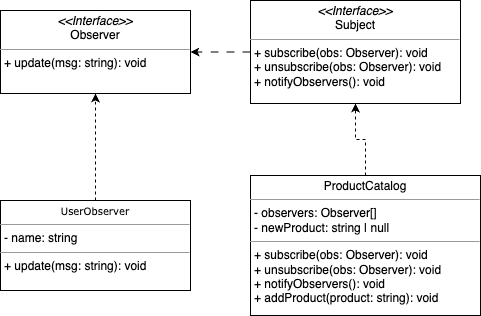

# Observer

## Introdução

O padrão de projeto Observer é uma solução de design que permite que um objeto (conhecido como Sujeito) notifique automaticamente uma lista de outros objetos (Observadores) sobre mudanças em seu estado. Este padrão é amplamente utilizado em situações onde é necessário manter múltiplos objetos sincronizados com as mudanças de estado de um único objeto.

---

## Definição e Propósito

O _Observer_ é um padrão de projeto comportamental que estabelece uma dependência "um-para-muitos" entre objetos, garantindo que quando um objeto muda de estado, todos os seus dependentes são notificados.

**Propósito:** Permitir que objetos observadores sejam automaticamente notificados e atualizados sempre que o estado do sujeito observado for alterado.

---

## Estrutura

A estrutura do padrão Observer consiste em:

1. **Subject (Sujeito):** Define uma interface para gerenciar os observadores (adicionar, remover e notificar).
2. **Observer (Observador):** Define uma interface que deve ser implementada pelos objetos que desejam receber notificações.
3. **ConcreteSubject (Sujeito Concreto):** Implementa o Subject e armazena o estado do objeto observado. Notifica os observadores quando há mudanças.
4. **ConcreteObserver (Observador Concreto):** Implementa a interface do Observer e atualiza seu estado em resposta às notificações do ConcreteSubject.

---

## Funcionamento

1. O Sujeito gerencia uma lista de observadores.
2. Observadores se registram no Sujeito para receber notificações.
3. Quando o estado do Sujeito muda, ele notifica todos os observadores registrados.
4. Os Observadores respondem à notificação atualizando seu estado.

---

## Vantagens

1. **Desacoplamento:** Permite que os sujeitos e os observadores operem de forma independente.
2. **Escalabilidade:** Facilita a adição de novos observadores sem modificar o código existente.
3. **Reatividade:** Implementa sistemas que respondem a eventos de forma automática.

---

## Desvantagens

1. **Sobrecarga de Notificações:** Muitos observadores podem gerar notificações excessivas.
2. **Dependência Circular:** Requer cuidado para evitar loops ou dependências cíclicas entre sujeitos e observadores.

---

## Aplicação

O padrão Observer é útil em diversas situações, como:

- Sistemas de notificação de eventos.
- Atualização de interfaces gráficas com base em mudanças no estado do modelo.
- Implementação de sistemas baseados em eventos, como sites de e-commerce.

---

## Exemplo de Implementação

No contexto do G2_Brechó, o padrão Observer é utilizado para notificar automaticamente os usuários sobre novos produtos adicionados ao catálogo.

---

## Diagrama

<center>
<figcaption> 

**Figura 1** - Diagrama do padrão de projeto *Observer*.

</figcaption>



<figcaption>

**Fonte:** <a href="https://github.com/valdersonjr" target="_blank">Valderson Pontes</a>, 2025.

</figcaption>
</center>

---

### Exemplo de Código

**Contexto:** No site G2_Brechó, os usuários se inscrevem para receber notificações sobre novos produtos.

#### Código

#### Observer.ts

```typescript
export interface Observer {
    update(message: string): void;
}  
```
#### ProductCatalog.ts
```typescript
import { Subject } from "./Subject";
import { Observer } from "./Observer";

export class ProductCatalog implements Subject {
  private observers: Observer[] = [];
  private newProduct: string | null = null;

  subscribe(observer: Observer): void {
    this.observers.push(observer);
  }

  unsubscribe(observer: Observer): void {
    this.observers = this.observers.filter(obs => obs !== observer);
  }

  notifyObservers(): void {
    this.observers.forEach(observer =>
      observer.update(`Novo produto adicionado: ${this.newProduct}`)
    );
  }

  addProduct(product: string): void {
    this.newProduct = product;
    console.log(`Produto "${product}" foi adicionado ao catálogo.`);
    this.notifyObservers();
  }
}
```

#### Subject.ts
```typescript
import { Observer } from "./Observer";

export interface Subject {
  subscribe(observer: Observer): void;
  unsubscribe(observer: Observer): void;
  notifyObservers(): void;
}
```

#### UserObserver.ts
```typescript
import { Observer } from "./Observer";

export class UserObserver implements Observer {
  constructor(private name: string) {}

  update(message: string): void {
    console.log(`Olá, ${this.name}! ${message}`);
  }
}
```


## Referências
- REFACTORING GURU. Design Patterns: Observer. Disponível em: https://refactoring.guru/pt-br/design-patterns/observer. Acesso em: 5 jan. 2025


## Histórico de Versões

| Versão | Data       | Descrição            | Autor(es)                                        | Revisor(es) | Resultado da Revisão |
| ------ | ---------- | -------------------- | ------------------------------------------------ | ----------- | -------------------- |
| `1.0`  | 5/01/2025  | Criação do documento | [Valderson](https://github.com/valdersonjr)     |             |                     |
| `1.0`  | 5/01/2025  | Codificação          | [Valderson](https://github.com/valdersonjr)     |             |                     |
