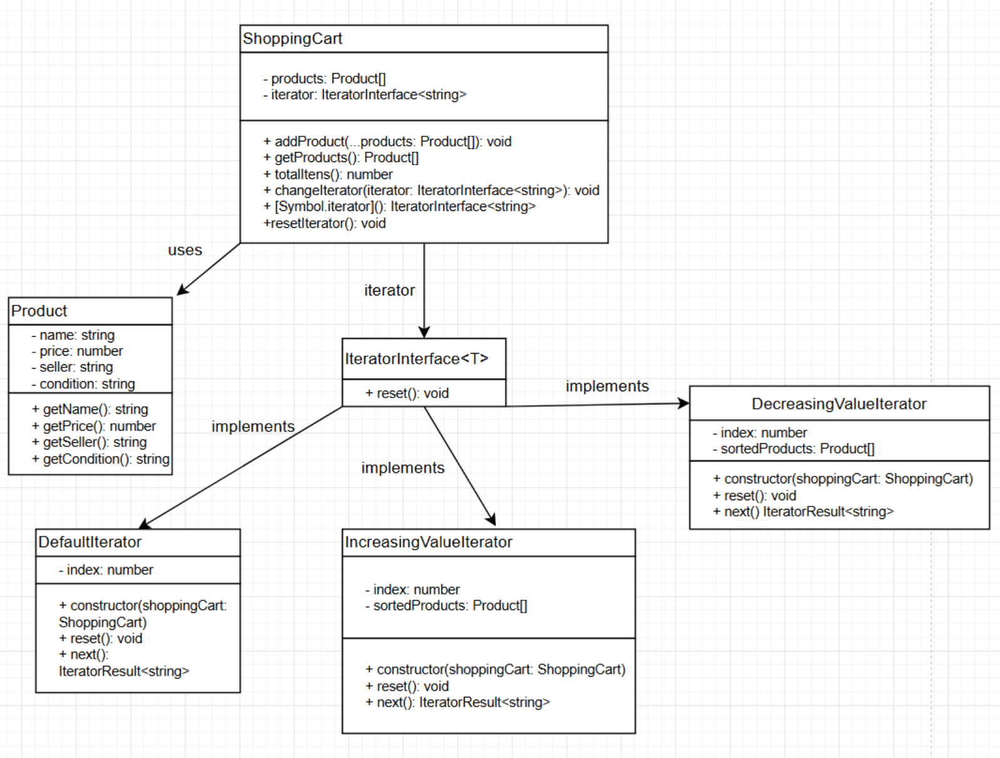
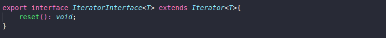
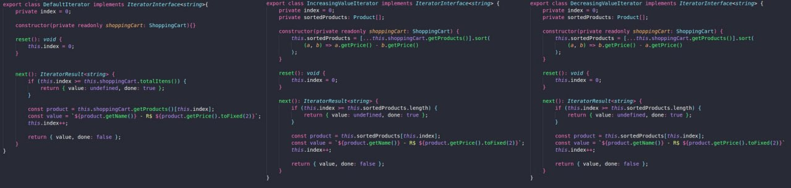
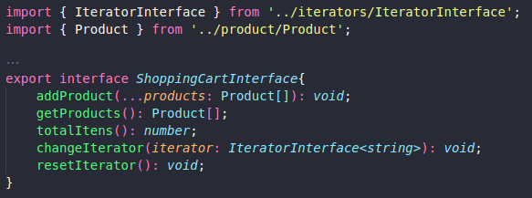
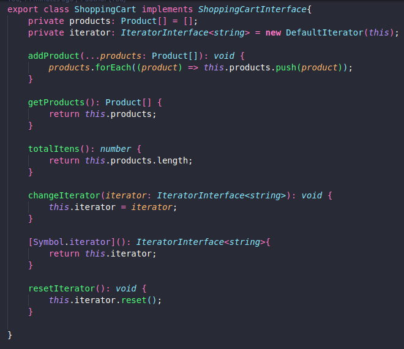
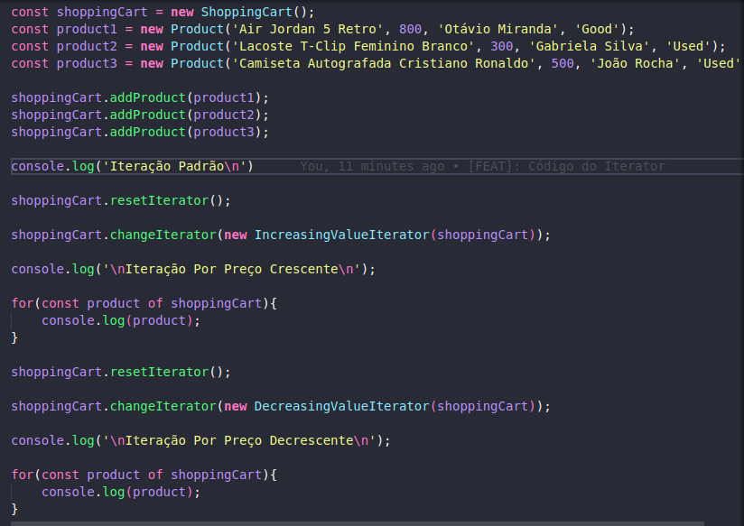
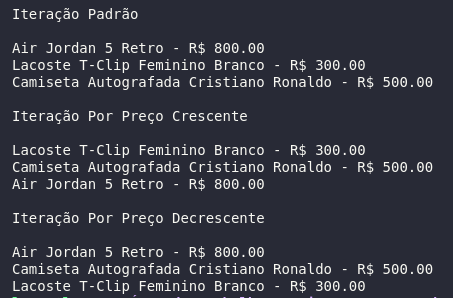

# Iterator

## Introdução

O padrão de projeto *Iterator* é um dos padrões comportamentais definidos pela *Gang of Four* (GoF) no livro clássico *Design Patterns: Elements of Reusable Object-Oriented Software* (Gamma et al., 1994). Ele é usado para fornecer um meio de acessar sequencialmente os elementos de uma coleção, sem expor sua estrutura interna.

## Definição e Propósito

O *Iterator* tem como objetivo fornecer uma maneira de acessar os elementos de uma coleção sequencialmente, sem expor sua estrutura interna. Isso é útil em situações onde se deseja percorrer diferentes estruturas de dados, como listas, árvores ou filas, de forma uniforme.

O *Iterator* é similar ao conceito de ponteiros ou índices em estruturas de dados, no sentido de navegar por seus elementos. Entretanto, uma vantagem do *Iterator* em relação a eles é a abstração, permitindo que o código que consome a coleção seja desacoplado de sua implementação.

O *Iterator* é um padrão já implementado por determinadas linguagens de programação. Os iteradores do Python e Java são exemplos do padrão *Iterator*, de forma que métodos como `__iter__` e `next` ou interfaces como `Iterator` permitem percorrer coleções de maneira padronizada.

## Estrutura

A estrutura de uma classe Iterator tem:

1. **Uma interface Iterator**: Declara as operações necessárias para percorrer uma coleção, como buscar o próximo elemento, verificar se há mais elementos, recuperar a posição atual e reiniciar a iteração.

2. **Iteradores concretos**: Implementam algoritmos específicos para percorrer uma coleção. Cada iterador concreto gerencia o progresso da travessia de forma independente, permitindo que várias instâncias percorram a mesma coleção simultaneamente, sem interferência.

3. **Uma interface Collection**: Declara métodos para obter iteradores compatíveis com a coleção. Esses métodos retornam a interface do iterador, garantindo que as coleções concretas possam oferecer diferentes tipos de iteradores.

4. **Coleções concretas**: Implementam a interface Collection e retornam instâncias de classes de iteradores concretos quando um iterador é solicitado. A lógica adicional da coleção, como armazenamento e manipulação dos dados, é encapsulada na mesma classe, mas não faz parte central do padrão Iterator.

5. **O cliente**: Trabalha com coleções e iteradores através de suas interfaces, garantindo independência de classes concretas. Em geral, os clientes obtêm iteradores diretamente de coleções, mas em alguns casos, podem criar iteradores personalizados para atender a requisitos específicos.

 

<figcaption> 

**Figura 1** - Diagramas do Iterator.

</figcaption>

<figcaption>

**Fonte:** <a href="https://refactoring.guru/design-patterns/iterator" target="_blank">Refactoring Guru</a>, 2025.

</figcaption>

## Utilidade

- É necessário percorrer uma coleção de objetos sem expor sua estrutura interna;
- Deseja-se implementar diferentes formas de iteração em coleções, como navegação reversa ou por filtros específicos.

## Vantagens

- Encapsulamento da lógica de iteração, permitindo que o cliente interaja com a coleção sem conhecer sua implementação interna;
- Independência entre a coleção e o algoritmo de iteração, facilitando a reutilização e a extensão;
- Possibilidade de percorrer a mesma coleção simultaneamente com vários iteradores.

## Desvantagens

- Pode aumentar a complexidade do código ao introduzir múltiplas classes e interfaces para suportar o padrão;
- Em coleções muito grandes, iteradores que armazenam o estado da iteração podem consumir mais memória do que abordagens simplificadas;
- A implementação de iteradores personalizados pode ser desafiadora para coleções não lineares ou com relações complexas entre elementos.

## Aplicação

### Desenvolvimento do Código

O desenvolvimento do código para aplicação prática do padrão de projeto *Iterator* foi feito de acordo com o [Diagrama](#elaboração-do-diagrama) apresentado. Foi utilizada a linguagem de programação Typescript e, para executá-lo, deve-se seguir os passos a seguir:

1. Entrar na pasta code/iterator/src

2. Ter instalado o npm (comando: *npm install*)

3. Executar o projeto com o comando *npm run start*

O padrão foi aplicado no cenário de uso de iterar sobre os produtos de um carrinho de compras com alguns produtos de diferentes formas: uma iteração sem critério, outra de forma crescente e outra de forma decrescente.

O resultado da execução dos comandos acima deve ser uma saída contendo a impressão dos produtos do carrinho, de diferentes formas.

Para fins de visualização sem execução de código ou utilização de linhas de comando, confira as Figuras de 2 a 5 abaixo.

<figcaption> 

**Figura 2** - Interface referentes a *Iterator*.

</figcaption>

<figcaption>

**Fonte:** <a href="https://github.com/LucasSpinosa" target="_blank">Lucas Spinosa</a>, 2025.

</figcaption>

<figcaption> 

**Figura 3** - Classes referentes a *Concrete Iterators*.

</figcaption>

<figcaption>

**Fonte:** <a href="https://github.com/LucasSpinosa" target="_blank">Lucas Spinosa</a>, 2025.

</figcaption>

<figcaption> 

**Figura 4** - Classe auxiliar *Product*.

</figcaption>

<figcaption>

**Fonte:** <a href="https://github.com/LucasSpinosa" target="_blank">Lucas Spinosa</a>, 2025.

</figcaption>

<figcaption> 

**Figura 5** - Interface referente a *Collection*.

</figcaption>

<figcaption>

**Fonte:** <a href="https://github.com/LucasSpinosa" target="_blank">Lucas Spinosa</a>, 2025.

</figcaption>

<figcaption> 

**Figura 6** - Classe referente a *Concrete Collection*.

</figcaption>

<figcaption>

**Fonte:** <a href="https://github.com/LucasSpinosa" target="_blank">Lucas Spinosa</a>, 2025.

</figcaption>

<figcaption> 

**Figura 7** - Main.

</figcaption>

<figcaption>

**Fonte:** <a href="https://github.com/LucasSpinosa" target="_blank">Lucas Spinosa</a>, 2025.

</figcaption>

<figcaption> 

**Figura 8** - Resultado.

</figcaption>

<figcaption>

**Fonte:** <a href="https://github.com/LucasSpinosa" target="_blank">Lucas Spinosa</a>, 2025.

</figcaption>

## Referências

> Gamma, E., Helm, R., Johnson, R., & Vlissides, J. (1994). Design Patterns: Elements of Reusable Object-Oriented Software. Addison-Wesley.

> Iterator. Refactoring Guru, 2024. Disponível em: <https://refactoring.guru/design-patterns/iterator>. Acesso em: 02 jan. de 2025.

## Histórico de Versão

| Versão | Data       | Descrição            | Autor(es)                                        | Revisor(es) | Resultado da Revisão |
| ------ | ---------- | -------------------- | ------------------------------------------------ | ----------- | -------------------- |
| `1.0`  | 02/01/2025 | Criação do documento | [Eduardo Belarmino](https://github.com/eduard0803) | --- | --- |
| `1.1`  | 03/01/2025 | Adição da seção Desenvolvimento do Código | [Lucas Spinosa](https://github.com/LucasSpinosa) | --- | --- |
| `1.2`  | 06/01/2025 | Adição do diagrama Iterator | [Luiz Guilherme](https://github.com/LuizPettengill) | --- | --- |