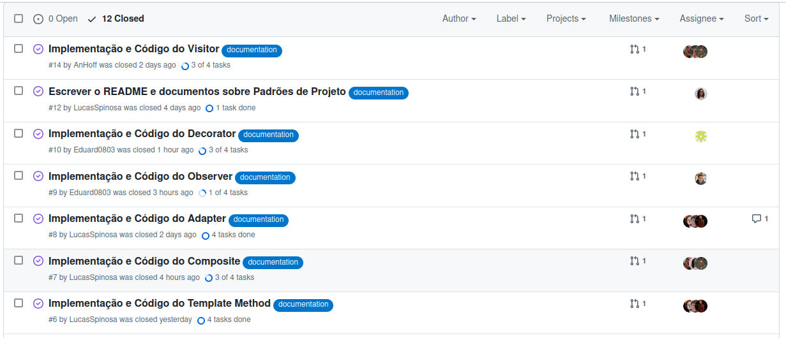
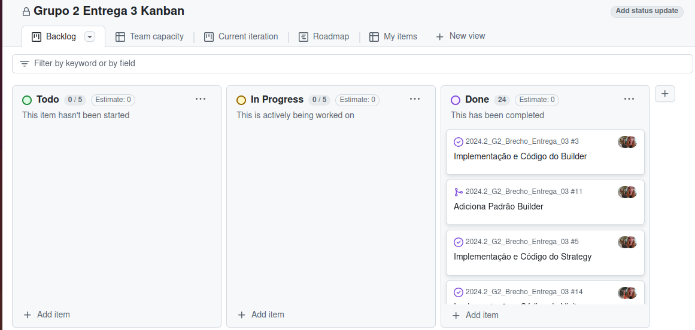

# 3.5. Iniciativas Extras (Padrões de Projeto)

## Issues

Para registrar as atividades a serem desenvolvidas para a entraga, bem como quem fica responsável pelas suas execuções, foram criadas issues no repositório.

As Issues podem ser acessado através desse [link](https://github.com/UnBArqDsw2024-2/2024.2_G2_Brecho_Entrega_03/issues).

## Kanban

Para auxiliar no acompanhamento do progresso das atividades desenvolvidas para a entrega, foi criado e utilizado um Kanban no repositório, de forma que o estado da atividade pode ser mudado conforme o progresso nela (Todo, In Progress, Done).

# Histórico de Versões
| Versão | Data       | Descrição              | Autor(es)                                                                                                                                          | Revisor(es)                                          | Resultado da Revisão                                         |
| ------ | ---------- | ---------------------- | -------------------------------------------------------------------------------------------------------------------------------------------------- | ---------------------------------------------------- | ---------------------------------------------------- |
| `1.0`  | 05/11/2024 | Criação do documento | [Lucas Spinosa](https://github.com/LucasSpinosa) | --- | --- |