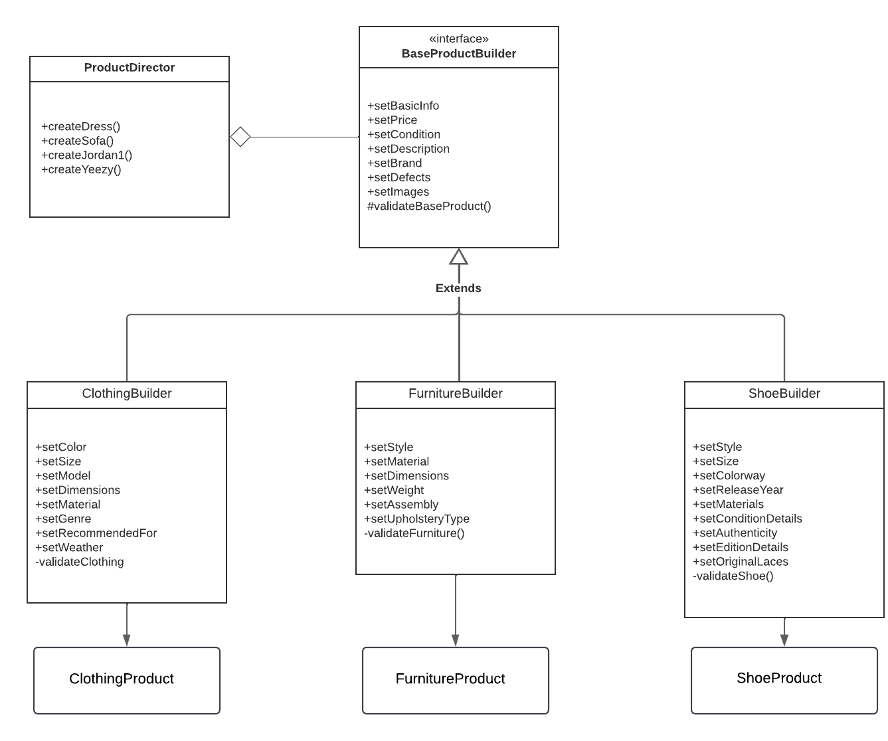
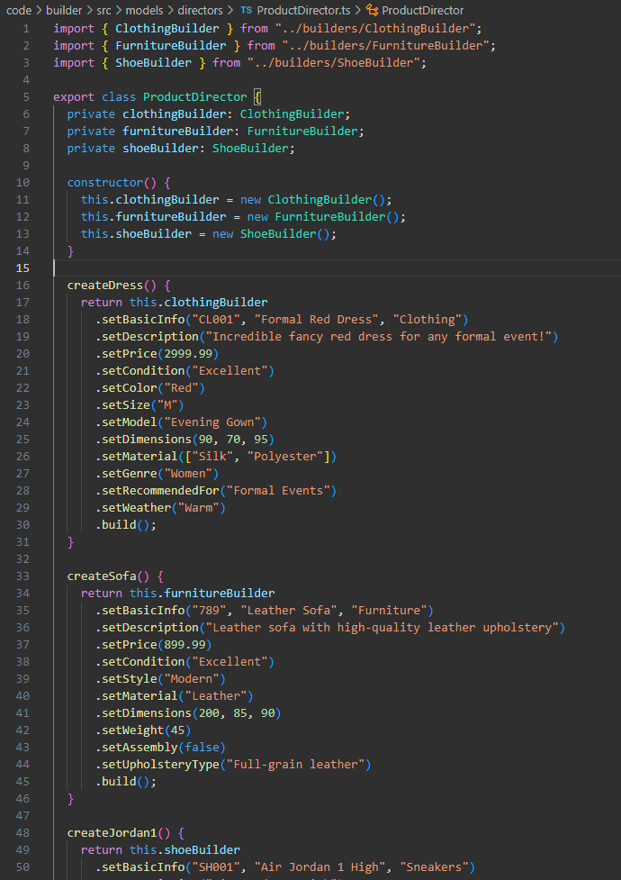

# Composite

## Introdução

O padrão de projeto *Composite* é um dos padrões estruturais definidos pela *Gang of Four* (GoF) no livro clássico *Design Patterns: Elements of Reusable Object-Oriented Software* (Gamma et al., 1994). Ele é usado para compor objetos como estruturas de árvore e então trabalhe com elas como se fossem objetos individuais, tratando estruturas e objetos da mesma forma.

## Definição e Propósito

De acordo com Gamma et al. (1994), o *Composite* tem como objetivo possibilitar a composição objetos como estruturas de árvore e trabalhe com elas como se fossem objetos individuais, permitindo que tanto objetos quanto composições de objetos sejam tratados de forma uniforme, sendo utilizados através de uma interface comum para ambos.

O que geralmente acontece é que os métodos na estrutura delegam tarefas para os elementos que a compõem. Os métodos nesses elementos, por sua vez, realizam algum tipo de trabalho, e retornam o resultado para a estrutura. Dessa maneira, usar o método na estrutura ou no objeto diretamente retorna o mesmo resultado, permitindo o tratamento idêntico no código.

Seu uso só faz sentido quando o modelo central da aplicação pode ser representado como uma árvore. Nesse caso, usar o *Composite* ajuda a simplificar a escrita do código do programa, facilitando a utilização da estrutura.

## Estrutura

A estrutura do Composite tem os seguintes elementos (Gamma et al., 1994):

1. *Component*: interface com métodos comuns para objetos e estruturas, que devem ser implementados por ambos.

2. *Leaf*: classe concreta que representa um objeto simples. Realiza atividades através dos métodos de *Component*.

3. *Composite*: classe concreta que representa um objeto composto por outros objetos (Leaf), sendo uma estrutura de árvore. Pode delegar atividades para seus componentes através dos métodos de *Component*.

<figcaption> 

**Figura 1** - Diagrama do padrão Composite

</figcaption>

<figcaption>

**Fonte:** <a href="https://refactoring.guru/pt-br/design-patterns/composite" target="_blank">Refactoring Guru</a>, 2024.

</figcaption>

## Utilidade

Segundo Refactoring Guru (2024), o *Composite* é útil em situações em que:

- Deve-se implementar uma estrutura de objetos em formato de árvore;

- É desejado que o código cliente (que vai utilizar os objetos e estruturas) trate os objetos simples e compostos da mesma maneira.

## Vantagens

Refactoring Guru (2024) ressalta que as vantagens do Composite são:

- Possibilidade de trabalhar com estruturas de árvore complexas mais convenientemente: utilize o polimorfismo e a recursão a seu favor;
- Princípio Aberto/Fechado: possibilidade de introduzir novos tipos de elementos na aplicação sem quebrar o código existente.

## Desvantagens

Segundo Refactoring Guru (2024) e Miranda (2020), as desvantagens são:

- Dificuldade em providenciar uma interface comum para classes cujas funcionalidades diferem muito. Pode ser necessário generalizar demais a interface Component, fazendo dela uma interface de difícil compreensão.
- Os objetos Leaf podem quebrar o Princípio da Segregação de Interface (os clientes não devem ser forçados a depender de interfaces que não utilizam) do SOLID, pois objetos Leaf tendem a ter métodos que não usam ou que não fazem nada.;

## Aplicação

<!-- A aplicação do padrão de projeto em questão se deu em duas etapas: criação do diagrama e desenvolvimento do código. Cada etapa pode ser conferida em detalhes a seguir. -->

### Elaboração do Diagrama

<!-- O desenvolvimento do diagrama do padrão de projeto *Builder* deve envolver as quatro estruturas apresentadas no tópico [Estrutura](#estrutura). O diagrama apresentado na **Figura 1** abaixo se refere à aplicação do padrão *Builder* em um caso de uso fictício, relacionado ao tema do trabalho do Grupo 02: UnBrechó.

<figcaption> 

**Figura 1** - Diagrama do padrão de projeto *Builder*.

</figcaption>

<figcaption>

**Fonte:** <a href="https://github.com/MarcoTulioSoares" target="_blank">Marco Túlio</a>, 2024.

</figcaption>

A utilização de um caso de uso fictício foi incentivada pela proposta acadêmica do presente projeto, de modo que fosse possível estudar os diversos padrões existentes antes de escolher um padrão definitivo a ser utilizado no projeto do UnBrechó.

As estruturas, conforme definido no tópico [Estrutura](#estrutura), são aplicadas no diagrama como classes da seguinte forma:

1. *Builder*: BasePructBuilder, ClothingBuilder, FurnitureBuilder, ShoeBuilder.

2. *Concrete Builder*: Builder.

3. *Director*: ProductDirector.

4. *Product*: BaseProduct, ClothingProduct, FurnitureProduct, ShoeProduct. -->

### Desenvolvimento do Código

<!-- O desenvolvimento do código para aplicação prática do padrão de projeto *Builder* foi feito de acordo com o [Diagrama](#elaboração-do-diagrama) apresentado. Foi utilizada a linguagem de programação Typescript e, para executá-lo, deve-se seguir os passos a seguir:

1. Entrar na pasta code/builder/src

2. Ter instalado o npm (comando: *npm install*)

3. Executar o projeto com o comando *npm run start*

O resultado da execução dos comandos acima deve ser uma saída contendo a representação dos produtos criados, cada um com suas distintas características.

Para fins de visualização sem execução de código ou utilização de linhas de comando, confira as Figuras de 2 a 5 abaixo.

<figcaption> 

**Figura 2** - Classes referentes a *Products*.

</figcaption>

<figcaption>

**Fonte:** <a href="https://github.com/marrcelo" target="_blank">Marcelo Magalhães</a>, 2024.

</figcaption>

<figcaption> 

**Figura 3** - Classes referentes a *Builders*.

</figcaption>

<figcaption>

**Fonte:** <a href="https://github.com/marrcelo" target="_blank">Marcelo Magalhães</a>, 2024.

</figcaption>

<figcaption> 

**Figura 4** - Classe referente a *Director*.

</figcaption>

<figcaption>

**Fonte:** <a href="https://github.com/marrcelo" target="_blank">Marcelo Magalhães</a>, 2024.

</figcaption>

<figcaption> 

**Figura 5** - Main.

</figcaption>

<figcaption>

**Fonte:** <a href="https://github.com/marrcelo" target="_blank">Marcelo Magalhães</a>, 2024.

</figcaption>

 -->

## Referências

> Gamma, E., Helm, R., Johnson, R., & Vlissides, J. (1994). Design Patterns: Elements of Reusable Object-Oriented Software. Addison-Wesley.

> MIRANDA, Otavio. Composite Teoria - Padrões de Projeto - Parte 14/45. YouTube. Disponível em: <https://www.youtube.com/watch?v=I0RqHDFQjVY&list=PLbIBj8vQhvm0VY5YrMrafWaQY2EnJ3j8H&index=14>. Acesso em: 10 dez. de 2020.

> Composite. Refactoring Guru, 2024. Disponível em: <https://refactoring.guru/pt-br/design-patterns/composite>. Acesso em: 03 jan. de 2025.

## Histórico de Versão

| Versão | Data       | Descrição            | Autor(es)                                        | Revisor(es) | Resultado da Revisão |
| ------ | ---------- | -------------------- | ------------------------------------------------ | ----------- | -------------------- |
| `1.0`  | 03/12/2024 | Criação do documento | [Lucas Spinosa](https://github.com/LucasSpinosa) | ---         | ---        