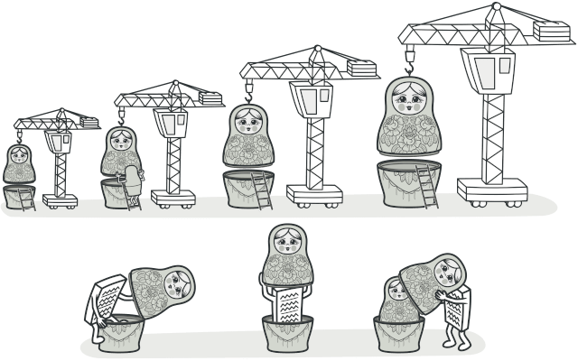
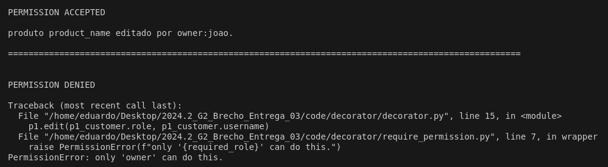
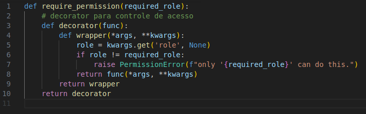
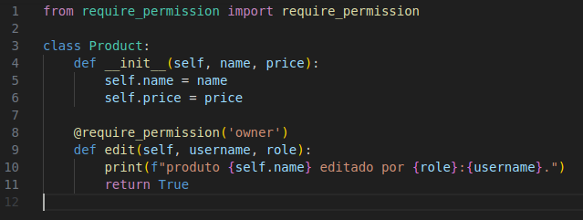
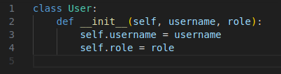
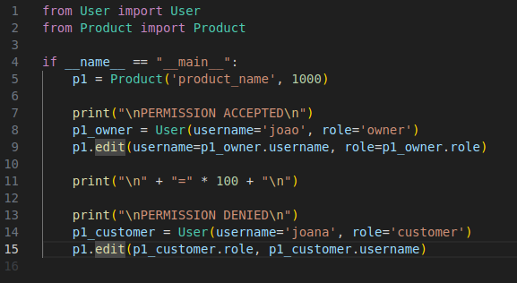

# Decorator

## Introdução

O padrão de projeto *Decorator* é um dos padrões estruturais definidos pela *Gang of Four* (GoF) no livro clássico *Design Patterns: Elements of Reusable Object-Oriented Software* (Gamma et al., 1994). Ele é utilizado para adicionar comportamentos ou responsabilidades a objetos individuais dinamicamente, sem modificar sua estrutura original.

## Definição e Propósito

O *Decorator* tem como objetivo permitir que responsabilidades adicionais sejam atribuídas a um objeto de forma dinâmica, oferecendo uma alternativa flexível à herança para a extensão de funcionalidades. Isso é útil em situações em que várias combinações de comportamentos diferentes precisam ser aplicadas a objetos sem criar subclasses excessivas.

O padrão *Decorator* é similar ao conceito de "envoltórios" ou "camadas" ao redor de um objeto, onde cada camada adiciona funcionalidades ou modifica o comportamento existente. Ao contrário de abordagens baseadas em herança, os decoradores trabalham com composição, tornando o código mais flexível e modular.

Linguagens de programação como Python e Java oferecem suporte direto ou indireto para o padrão *Decorator*. No Python, decoradores são uma funcionalidade nativa utilizada para modificar ou estender o comportamento de funções e métodos.

 

<figcaption> 

**Figura 1** - Explicação do *Decorator*.

**Fonte:** <a href="https://refactoring.guru/design-patterns/decorator" target="_blank">Refactoring Guru</a>, 2025.

</figcaption>

## Estrutura

A organização do padrão *Decorator* é composta pelos seguintes elementos:

1. **Componente**: Define a interface compartilhada por todos os objetos, incluindo os que serão decorados e os próprios decoradores.

2. **Componente Concreto**: Representa a classe que implementa o comportamento padrão dos objetos a serem decorados. Esse comportamento pode ser estendido dinamicamente por meio dos decoradores.

3. **Decorador Base**: Uma classe que encapsula outro objeto, referenciando-o através de um campo que segue a interface do componente. Isso permite que tanto objetos concretos quanto decoradores sejam armazenados e manipulados de maneira uniforme. O decorador base redireciona as operações para o objeto encapsulado.

4. **Decoradores Concretos**: São extensões específicas do decorador base, que adicionam ou modificam funcionalidades. Eles implementam lógica adicional antes ou depois de delegar as chamadas ao objeto encapsulado.

5. **Cliente**: É responsável por combinar objetos e decoradores em diferentes configurações, mantendo sempre a interação por meio da interface do componente. Isso possibilita empilhar múltiplas camadas de decoradores, criando comportamentos complexos de maneira flexível.

## Utilidade do Decorator

- Quando é necessário adicionar funcionalidades a objetos de forma dinâmica, sem alterar sua estrutura original;
- Ideal para situações em que diferentes combinações de comportamentos precisam ser aplicadas a objetos, evitando a criação de múltiplas subclasses;
- Permite adicionar ou modificar funcionalidades em tempo de execução, adaptando o comportamento dos objetos conforme a necessidade.

## Vantagens do Decorator

- **Flexibilidade**: Permite estender funcionalidades sem alterar a classe original ou afetar outros objetos;
- **Composição**: Estimula a composição sobre a herança, tornando o código mais modular e reutilizável;
- **Camadas de Funcionalidade**: Facilita a aplicação de múltiplas responsabilidades ou comportamentos ao mesmo objeto, combinando decoradores de maneira flexível.

## Desvantagens do Decorator

- **Complexidade Adicional**: A introdução de decoradores pode tornar o código mais difícil de compreender e manter, devido ao aumento no número de classes;
- **Depuração Difícil**: A cadeia de chamadas entre decoradores e o objeto original pode dificultar a identificação de problemas;
- **Sobrecarga de Configuração**: Aplicar muitos decoradores a um único objeto pode resultar em sobrecarga de configuração e aumento na complexidade de gerenciamento.

## Aplicação do Decorator

A aplicação do padrão de projeto levou em conta o cenário de uso do controle de acesso no brechó. Foi elaborado um diagrama da classe e o desenvolvimento do código. Cada etapa pode ser conferida a seguir.

### Elaboração do Diagrama

### Desenvolvimento do Código

O desenvolvimento do código para aplicação prática do padrão de projeto *Decorator* foi feito utilizando a linguagem de programação Python e, para executá-lo, deve-se seguir os passos a seguir:

1. Entrar na pasta code/decorator/

2. Ter instalado o interpretador python (comando: *sudo apt install python3*)

3. Executar o projeto com o comando *python3 decorator.py*

O resultado da execução dos comandos deve ser um output no console divido em duas partes por uma linha dupla tracejada, a primeira uma execução sendo aceita e a outra negada, conforme a imagem abaixo.

<figcaption>

**Figura 2** - Resultado da execução do script.

**Fonte:** <a href="https://github.com/eduard0803" target="_blank">Eduardo Belarmino</a>, 2025.

**Figura 3** - Decorator para controle de acesso.

**Fonte:** <a href="https://github.com/eduard0803" target="_blank">Eduardo Belarmino</a>, 2025.

</figcaption>

    <figcaption><strong>Figura 4</strong> - Classe para representar um produto.</figcaption> 
    
    <figcaption> <strong>Fonte:</strong> <a href="https://github.com/eduard0803" target="_blank">Eduardo Belarmino</a>, 2025.</figcaption>

    <figcaption><strong>Figura 5</strong> - Classe para representar um usuário.</figcaption> 
    
    <figcaption> <strong>Fonte:</strong> <a href="https://github.com/eduard0803" target="_blank">Eduardo Belarmino</a>, 2025.</figcaption>

<figcaption>

**Figura 6** - Prova de conceito.

**Fonte:** <a href="https://github.com/eduard0803" target="_blank">Eduardo Belarmino</a>, 2025.

</figcaption>

## Referências

> Gamma, E., Helm, R., Johnson, R., & Vlissides, J. (1994). Design Patterns: Elements of Reusable Object-Oriented Software. Addison-Wesley.

> Decorator. Refactoring Guru, 2025. Disponível em: <https://refactoring.guru/design-patterns/decorator>. Acesso em: 03 jan. de 2025.

## Histórico de Versão

| Versão | Data       | Descrição            | Autor(es)                                        | Revisor(es) | Resultado da Revisão |
| ------ | ---------- | -------------------- | ------------------------------------------------ | ----------- | -------------------- |
| `1.0`  | 03/01/2025 | Criação do documento | [Eduardo Belarmino](https://github.com/eduard0803) | --- | --- |
| `1.1`  | 03/01/2025 | Adição do código de exemplo | [Eduardo Belarmino](https://github.com/eduard0803) | --- | --- |
