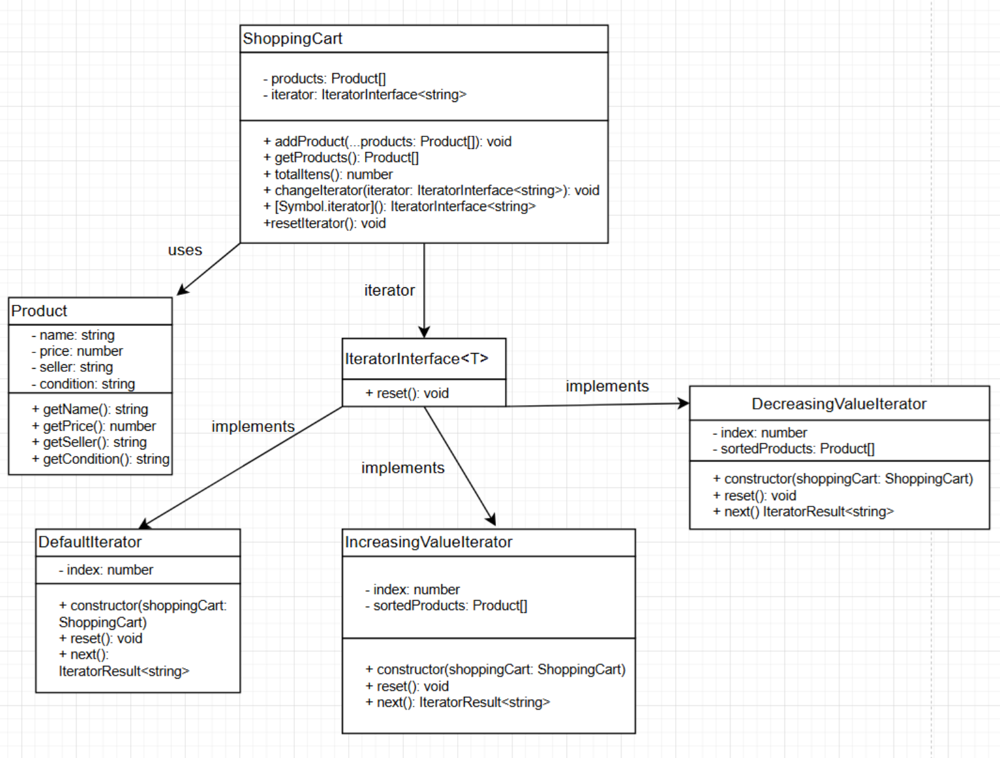

# Iterator

## Introdução

O padrão de projeto *Iterator* é um dos padrões comportamentais definidos pela *Gang of Four* (GoF) no livro clássico *Design Patterns: Elements of Reusable Object-Oriented Software* (Gamma et al., 1994). Ele é usado para fornecer um meio de acessar sequencialmente os elementos de uma coleção, sem expor sua estrutura interna.

## Definição e Propósito

O *Iterator* tem como objetivo fornecer uma maneira de acessar os elementos de uma coleção sequencialmente, sem expor sua estrutura interna. isso é útil em situações onde se deseja percorrer diferentes estruturas de dados, como listas, árvores ou filas, de forma uniforme.

O *Iterator* é similar ao conceito de ponteiros ou índices em estruturas de dados, no sentido de navegar por seus elementos. Entretanto, uma vantagem do *Iterator* em relação a eles é a abstração, permitindo que o código que consome a coleção seja desacoplado de sua implementação.

O *Iterator* é um padrão já implementado por determinadas linguagens de programação. Os iteradores do Python e Java são exemplos do padrão *Iterator*, de forma que métodos como `__iter__` e `next` ou interfaces como `Iterator` permitem percorrer coleções de maneira padronizada.

<figcaption>

**Fonte:** <a href="https://github.com/eduard0803" target="_blank">Eduardo Belarmino</a>, 2024.

</figcaption>

## Estrutura

A estrutura de uma classe Iterator tem:

1. **Uma interface Iterator**: Declara as operações necessárias para percorrer uma coleção, como buscar o próximo elemento, verificar se há mais elementos, recuperar a posição atual e reiniciar a iteração.

2. **Iteradores concretos**: Implementam algoritmos específicos para percorrer uma coleção. Cada iterador concreto gerencia o progresso da travessia de forma independente, permitindo que várias instâncias percorram a mesma coleção simultaneamente, sem interferência.

3. **Uma interface Collection**: Declara métodos para obter iteradores compatíveis com a coleção. Esses métodos retornam a interface do iterador, garantindo que as coleções concretas possam oferecer diferentes tipos de iteradores.

4. **Coleções concretas**: Implementam a interface Collection e retornam instâncias de classes de iteradores concretos quando um iterador é solicitado. A lógica adicional da coleção, como armazenamento e manipulação dos dados, é encapsulada na mesma classe, mas não faz parte central do padrão Iterator.

5. **O cliente**: Trabalha com coleções e iteradores através de suas interfaces, garantindo independência de classes concretas. Em geral, os clientes obtêm iteradores diretamente de coleções, mas em alguns casos, podem criar iteradores personalizados para atender a requisitos específicos.

 

<figcaption> 

**Figura 1** - Diagrama do Iterator.

</figcaption>

<figcaption>

**Fonte:** <a href="https://refactoring.guru/design-patterns/iterator" target="_blank">Refactoring Guru</a>, 2024.

</figcaption>

## Utilidade

- É necessário percorrer uma coleção de objetos sem expor sua estrutura interna;
- Deseja-se implementar diferentes formas de iteração em coleções, como navegação reversa ou por filtros específicos.

## Vantagens

- Encapsulamento da lógica de iteração, permitindo que o cliente interaja com a coleção sem conhecer sua implementação interna;
- Independência entre a coleção e o algoritmo de iteração, facilitando a reutilização e a extensão;
- Possibilidade de percorrer a mesma coleção simultaneamente com vários iteradores.

## Desvantagens

- Pode aumentar a complexidade do código ao introduzir múltiplas classes e interfaces para suportar o padrão;
- Em coleções muito grandes, iteradores que armazenam o estado da iteração podem consumir mais memória do que abordagens simplificadas;
- A implementação de iteradores personalizados pode ser desafiadora para coleções não lineares ou com relações complexas entre elementos.

## Aplicação

<!-- A aplicação do padrão de projeto em questão se deu em duas etapas: criação do diagrama e desenvolvimento do código. Cada etapa pode ser conferida em detalhes a seguir. -->

### Elaboração do Diagrama

<!-- O desenvolvimento do diagrama do padrão de projeto *Builder* deve envolver as quatro estruturas apresentadas no tópico [Estrutura](#estrutura). O diagrama apresentado na **Figura 1** abaixo se refere à aplicação do padrão *Builder* em um caso de uso fictício, relacionado ao tema do trabalho do Grupo 02: UnBrechó.

<figcaption> 

**Figura 1** - Diagrama do padrão de projeto *Builder*.

</figcaption>

<figcaption>

**Fonte:** <a href="https://github.com/MarcoTulioSoares" target="_blank">Marco Túlio</a>, 2024.

</figcaption>

A utilização de um caso de uso fictício foi incentivada pela proposta acadêmica do presente projeto, de modo que fosse possível estudar os diversos padrões existentes antes de escolher um padrão definitivo a ser utilizado no projeto do UnBrechó.

As estruturas, conforme definido no tópico [Estrutura](#estrutura), são aplicadas no diagrama como classes da seguinte forma:

1. *Builder*: BasePructBuilder, ClothingBuilder, FurnitureBuilder, ShoeBuilder.

2. *Concrete Builder*: Builder.

3. *Director*: ProductDirector.

4. *Product*: BaseProduct, ClothingProduct, FurnitureProduct, ShoeProduct. -->

### Desenvolvimento do Código

<!-- O desenvolvimento do código para aplicação prática do padrão de projeto *Builder* foi feito de acordo com o [Diagrama](#elaboração-do-diagrama) apresentado. Foi utilizada a linguagem de programação Typescript e, para executá-lo, deve-se seguir os passos a seguir:

1. Entrar na pasta code/builder/src

2. Ter instalado o npm (comando: *npm install*)

3. Executar o projeto com o comando *npm run start*

O resultado da execução dos comandos acima deve ser uma saída contendo a representação dos produtos criados, cada um com suas distintas características.

Para fins de visualização sem execução de código ou utilização de linhas de comando, confira as Figuras de 2 a 5 abaixo.

<figcaption> 

**Figura 2** - Classes referentes a *Products*.

</figcaption>

<figcaption>

**Fonte:** <a href="https://github.com/marrcelo" target="_blank">Marcelo Magalhães</a>, 2024.

</figcaption>

<figcaption> 

**Figura 3** - Classes referentes a *Builders*.

</figcaption>

<figcaption>

**Fonte:** <a href="https://github.com/marrcelo" target="_blank">Marcelo Magalhães</a>, 2024.

</figcaption>

<figcaption> 

**Figura 4** - Classe referente a *Director*.

</figcaption>

<figcaption>

**Fonte:** <a href="https://github.com/marrcelo" target="_blank">Marcelo Magalhães</a>, 2024.

</figcaption>

<figcaption> 

**Figura 5** - Main.

</figcaption>

<figcaption>

**Fonte:** <a href="https://github.com/marrcelo" target="_blank">Marcelo Magalhães</a>, 2024.

</figcaption>

 -->

## Referências

> Gamma, E., Helm, R., Johnson, R., & Vlissides, J. (1994). Design Patterns: Elements of Reusable Object-Oriented Software. Addison-Wesley.

> Iterator. Refactoring Guru, 2024. Disponível em: <https://refactoring.guru/design-patterns/iterator>. Acesso em: 30 dez. de 2024.

## Histórico de Versão

| Versão | Data       | Descrição            | Autor(es)                                        | Revisor(es) | Resultado da Revisão |
| ------ | ---------- | -------------------- | ------------------------------------------------ | ----------- | -------------------- |
| `1.0`  | 02/01/2025 | Criação do documento | [Eduardo Belarmino](https://github.com/eduard0803) | --- | --- |
