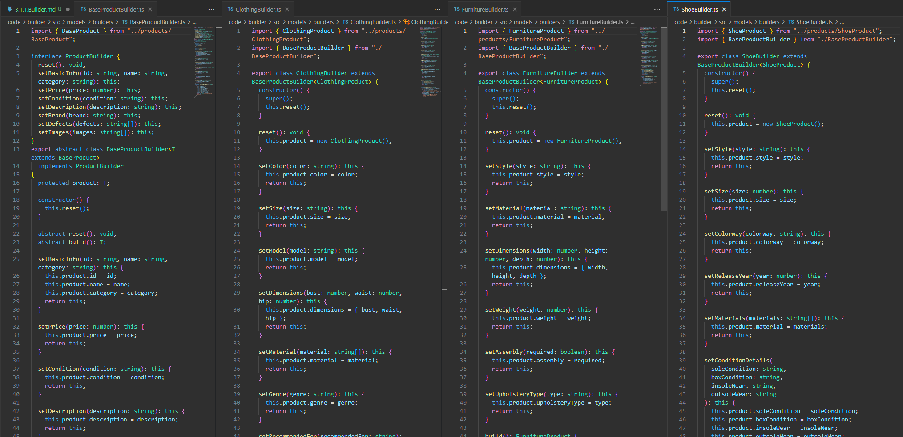
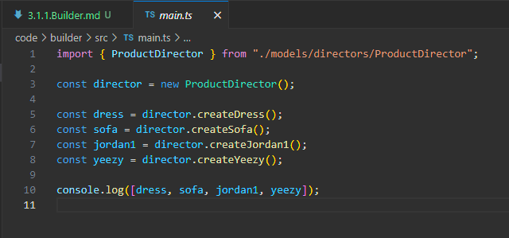

# Singleton

## Introdução

O padrão de projeto *Singleton* é um dos padrões criacionais definidos pela *Gang of Four* (GoF) no livro clássico *Design Patterns: Elements of Reusable Object-Oriented Software* (Gamma et al., 1994). Ele é usado para garantir que uma classe tenha apenas uma única instância na aplicação, com um ponto de acesso global para a mesma.

## Definição e Propósito

De acordo com Gamma et al. (1994), o *Singleton* tem como objetivo garantir que uma classe tenha apenas uma instância na aplicação, com um ponto de acesso global para ela. De acordo com Miranda (2020), isso é útil em situações onde se tem recursos compartilhados pela aplicação, como um logger, acesso banco de dados, entre outros.

O Singleton é similar ao conceito de variáveis globais, no sentido de fornecer seu valor para qualquer entidade na aplicação que queira acessá-lo. Entretanto, uma vantagen do Singleton em relação a elas é a possibilidade de encapsulamento, impedindo sobrescrita.

O Singleton é um padrão já implementado naturalmente por determinadas linguagens de programação. Miranda (2020) afirma que o sistema de módulos do JavaScript e TypeScript são Singletons, de forma que toda importação de módulo aponta para a mesma instância. 

## Estrutura

A estrutura de uma classe Singleton tem:

1. Um *atributo estático privado* que guarda a instância do Singleton. Inicialmente começa com valor nulo, mas posteriormente recebe a instância;

2. Uma *função construtora privada* (impedindo que instâncias novas sejam criadas com **new**);

3. Um *getter* que instancia a classe Singleton e retorna a instância (se a instância já existe, é retornada).

<center>
<figcaption> 

**Figura 1** - Diagrama de uma classe Singleton.

</figcaption>


<figcaption>

**Fonte:** <a href="https://refactoring.guru/design-patterns/singleton" target="_blank">Refactoring Guru</a>, 2024.

</figcaption>
</center>

## Utilidade

Segundo Miranda (2020), o Singleton é útil em situações em que:

- Uma classe precisa ter somente uma instância disponível para todo o programa;

- Perceber que está usando variáveis globais para manter partes importantes do programa (como variáveis de configuração usadas por toda a aplicação).

## Vantagens

Miranda (2020) ressalta que as vantagens do Singleton são:

- Ter um acesso controlado à instância única da classe;
- Substituição de variáveis globais;
- Uso de lazy instantiation, isto é, só criar a instância quando necessário.

## Desvantagens

Segundo Refactoring Guru (2024), as desvantagens são:

- Violação do Princípio de Resposanbilidade Única do SOLID, visto que a classe está resolvendo dois problemas.
- Requer tratamento para ambientes de concorrência para que múltiplas threads não criem um objeto singleton várias vezes.
- Pode ser difícil realizar teste unitário pois muitos frameworks de teste realizam herança para produzir objetos mockados. Como o construtor estático da classe é privado e sobrescrever métodos estáticos é impossível em muitas linguagens, é necessário pensar em um jeito criativo de mockar a classe.
- Pode mascarar design ruim, como quando componentes de um programa sabem demais um do outro.

## Aplicação

<!-- A aplicação do padrão de projeto em questão se deu em duas etapas: criação do diagrama e desenvolvimento do código. Cada etapa pode ser conferida em detalhes a seguir. -->

### Elaboração do Diagrama

<!-- O desenvolvimento do diagrama do padrão de projeto *Builder* deve envolver as quatro estruturas apresentadas no tópico [Estrutura](#estrutura). O diagrama apresentado na **Figura 1** abaixo se refere à aplicação do padrão *Builder* em um caso de uso fictício, relacionado ao tema do trabalho do Grupo 02: UnBrechó.

<center>
<figcaption> 

**Figura 1** - Diagrama do padrão de projeto *Builder*.

</figcaption>


<figcaption>

**Fonte:** <a href="https://github.com/MarcoTulioSoares" target="_blank">Marco Túlio</a>, 2024.

</figcaption>
</center>

A utilização de um caso de uso fictício foi incentivada pela proposta acadêmica do presente projeto, de modo que fosse possível estudar os diversos padrões existentes antes de escolher um padrão definitivo a ser utilizado no projeto do UnBrechó.

As estruturas, conforme definido no tópico [Estrutura](#estrutura), são aplicadas no diagrama como classes da seguinte forma:

1. *Builder*: BasePructBuilder, ClothingBuilder, FurnitureBuilder, ShoeBuilder.

2. *Concrete Builder*: Builder.

3. *Director*: ProductDirector.

4. *Product*: BaseProduct, ClothingProduct, FurnitureProduct, ShoeProduct. -->

### Desenvolvimento do Código

O desenvolvimento do código para a aplicação prática do padrão de projeto *Singleton* foi feito de acordo com a [estrutura](#estrutura) apresentada, foram feitas modificações para se adequar as convenções da linguagem. Foi utilizada a linguagem de programação Python e para executá-lo, deve-se seguir os passos a seguir:

1. Entrar na pasta `code/singleton/`

2. Ter instalado o interpretador python (comando *sudo apt install python3*)

3. Executar o script com o comando *python3 singleton.py*

O resultado da execução dos comandos acima deve ser uma saída contendo três vezes a palavra `True`, significando que os três objetos criados são a mesma instância.

<center>
<figcaption>

**Script 1** - Classe referente ao padrão singleton.

</figcaption>
</center>

```python
class Singleton:
    __instance = None

    def __new__(cls):
        if cls.__instance is None:
            cls.__instance = super(Singleton, cls).__new__(cls)
        return cls.__instance

    @classmethod
    def get_instance(cls):
        if cls.__instance is None:
            cls.__instance = cls()
        return cls.__instance


if __name__ == "__main__":
    db1 = Singleton.get_instance()
    db2 = Singleton()
    db3 = Singleton.get_instance()

    print(db1 is db2)
    print(db1 is db3)
    print(db2 is db3)
```

<center>
<figcaption>

**Fonte:** <a href="https://github.com/eduard0803" target="_blank">Eduardo Belarmino</a>, 2024.

</figcaption>
</center>

<!-- O desenvolvimento do código para aplicação prática do padrão de projeto *Builder* foi feito de acordo com o [Diagrama](#elaboração-do-diagrama) apresentado. Foi utilizada a linguagem de programação Typescript e, para executá-lo, deve-se seguir os passos a seguir:

1. Entrar na pasta code/builder/src

2. Ter instalado o npm (comando: *npm install*)

3. Executar o projeto com o comando *npm run start*

O resultado da execução dos comandos acima deve ser uma saída contendo a representação dos produtos criados, cada um com suas distintas características.

Para fins de visualização sem execução de código ou utilização de linhas de comando, confira as Figuras de 2 a 5 abaixo.

<center>
<figcaption> 

**Figura 2** - Classes referentes a *Products*.

</figcaption>


<figcaption>

**Fonte:** <a href="https://github.com/marrcelo" target="_blank">Marcelo Magalhães</a>, 2024.

</figcaption>
</center>

<center>
<figcaption> 

**Figura 3** - Classes referentes a *Builders*.

</figcaption>



<figcaption>

**Fonte:** <a href="https://github.com/marrcelo" target="_blank">Marcelo Magalhães</a>, 2024.

</figcaption>
</center>

<center>
<figcaption> 

**Figura 4** - Classe referente a *Director*.

</figcaption>


<figcaption>

**Fonte:** <a href="https://github.com/marrcelo" target="_blank">Marcelo Magalhães</a>, 2024.

</figcaption>
</center>

<center>
<figcaption> 

**Figura 5** - Main.

</figcaption>



<figcaption>

**Fonte:** <a href="https://github.com/marrcelo" target="_blank">Marcelo Magalhães</a>, 2024.

</figcaption>
</center> -->

## Referências

> Gamma, E., Helm, R., Johnson, R., & Vlissides, J. (1994). Design Patterns: Elements of Reusable Object-Oriented Software. Addison-Wesley.

> MIRANDA, Otavio. Singleton Teoria - Padrões de Projeto - Parte 4/45. YouTube. Disponível em: <https://www.youtube.com/watch?v=x9h8MgAvi_I&list=PLbIBj8vQhvm0VY5YrMrafWaQY2EnJ3j8H&index=4>. Acesso em: 10 dez. de 2020.

> Singleton. Refactoring Guru, 2024. Disponível em: <https://refactoring.guru/design-patterns/singleton>. Acesso em: 30 dez. de 2024.

## Histórico de Versão

| Versão | Data       | Descrição            | Autor(es)                                        | Revisor(es) | Resultado da Revisão |
| ------ | ---------- | -------------------- | ------------------------------------------------ | ----------- | -------------------- |
| `1.0`  | 30/12/2024 | Criação do documento | [Lucas Spinosa](https://github.com/LucasSpinosa) | --- | --- |
| `1.1`  | 31/12/2024 | Adição do código de exemplo | [Eduardo Belarmino](https://github.com/eduard0803) | --- | --- |
